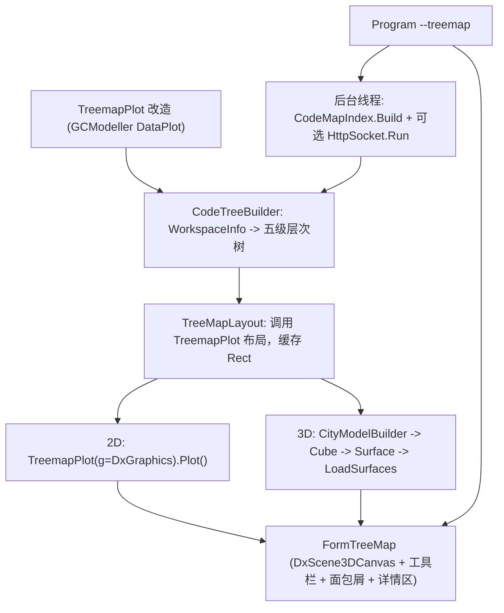

## 产品概述

在 `g:\DevAgent\src\CodeMap\CodeMap.vbproj` 中新增「代码库 TreeMap 可视化」功能：复用上一轮已建成的代码符号索引（`CodeMapIndex` / `WorkspaceInfo`），把加载进来的代码库按 **vbproj → folder → source file → type → function/sub/property** 五级层次构建成一棵可度量的树，然后用 DirectX 加速的画布在 `FormTreeMap` 窗体上绘制 —— 支持 **2D 平面 treemap** 与 **3D 城市**（按代码文本长度把符号挤出为高楼长方体，在 2D 的 [x,y] 布局基础上形成街道天际线）两种模式。

## 核心功能

- **层次建模**：从只读工作区解析出五级层次树；每个节点带行数 / 字符数 / 符号数三种度量，父节点度量为子节点之和。
- **2D 模式**：一张平面 squarified treemap，容器节点带内边距与标题条，叶子节点按层级着色并显示标签。
- **3D 模式**：把 2D 布局得到的 [x,y,w,h] 矩形按度量值映射为高度 z，生成长方体"高楼"，留出行间距形成街道，可用鼠标环绕/缩放/平移观察天际线。
- **交互**：
- 悬停显示符号全名 / 路径 / 行数 / 代码长度提示，点击后在下方详情区显示符号源码
- 工具栏一键切换 2D / 3D
- 点击矩形逐级下钻（vbproj→folder→file→type→member），顶部面包屑可逐级回退
- 度量切换（代码行数 / 字符数 / 符号数）
- **规模控制**：3D 模式提供"最大建筑数"上限（默认 3000，取度量最大者）与"挤出深度"选择器（到 file 或 type 层），保证帧率。
- **启动方式**：新增 `--treemap` 开关，打开 `FormTreeMap` 并在后台构建索引（复用 `CodeMapIndex`）；若同时给了 `--port`，HTTP 服务在后台线程并行运行而窗体在主线程。

## 边界与约束

- 全程只读，不修改被可视化的代码库。
- `TreemapPlot` 是 GCModeller 共用的基础库，改造必须向后兼容（扁平 `Nodes` 用法行为不变）。
- 2D 与 3D 共用同一份布局结果，保证"3D 建立在 2D 的 [x,y] 布局之上"。

## 技术栈选择

- 语言 / 框架：VB.NET，.NET 10（`net10.0-windows`，WinForms）。沿用 `CodeMap.vbproj` 既有的 `UseWindowsForms` / `UseWPF` / `MyType=WindowsForms`。
- 工作区与符号：`Microsoft.VisualBasic.ApplicationServices.Development.VisualStudio`（既有引用，复用 `WorkspaceInfo` / `SourceFile` / `LanguageSymbolType` / `SourceLocations`）。
- TreeMap 布局与绘制：`Microsoft.VisualBasic.Data.Plots.TreemapPlot`（DataPlot，需新增引用）+ `Microsoft.VisualBasic.Imaging.IGraphics`。
- GPU 加速 2D：`Microsoft.VisualBasic.Drawing.DirectX.DxGraphics`（`Inherits IGraphics`，可直接注入 `PlotEngine`）。
- 3D 渲染：`Microsoft.VisualBasic.Drawing.DirectX.DxScene3DCanvas`（DxCanvas.vbproj，需新增引用）+ `Scene` / `Surface` / `Cube` / `Point3D` / `OrbitCameraController`。
- 索引与 HTTP：既有 `CodeMap.CodeIndex` + `CodeMap.HttpService`（Flute）保持不变。

## 实现方案

### 总体策略

分五层推进，「基础库改造 → 层次建模 → 布局 → 渲染 → 窗体/入口」，每层只依赖下一层，2D 与 3D 共用同一份布局结果：



### 关键技术决策

1. **`DxGraphics` 本身就是 `IGraphics`**：`Public Class DxGraphics : Inherits IGraphics`。而 `PlotEngine` 已经有 `Public Sub New(g As IGraphics, Optional theme As PlotTheme = Nothing)`（且 `_ownsGraphics = False`，不会释放宿主画布，注释里点名 DxGraphics）。因此 2D 加速只需给 `TreemapPlot` 补一个同签名构造函数转发 `MyBase.New(g, theme)`，**绘制代码零改动**即可跑在 Direct2D 上。
2. **布局与绘制分离**：给 `TreemapPlot` 增加 `Public Function LayoutNodes(width, height) As List(Of TreemapNode)`（只做 squarify、不绘制），`Plot()` 内部改为「先 `LayoutNodes` 再绘制」。3D 直接复用这份 [x,y] 结果，天然满足"3D 建立在 2D 布局之上"，且命中测试在 2D/3D 下共用一套 `Rect`。
3. **嵌套布局保持向后兼容**：`TreemapNode` 新增 `Children`（默认空）。`Plot()` 判断：整棵树无任何 `Children` 时走原来的扁平路径；有 `Children` 时递归 —— 容器节点先按 `Children` 之和在自己的 `Rect` 内再切一次 squarify，并预留 `GroupPadding` 内边距与 `HeaderHeight` 标题条。
4. **3D 用 `Cube` 生成长方体**：`New Cube(vertices As Point3D(), brushes As Brush())` 一次给出 8 顶点 6 笔刷，产出 `faces As Surface()`（6 个四边形）。按布局矩形 [x,y,w,h] + 高度 z 算 8 个 `Point3D`，收集所有 `cube.faces` 交给 `DxScene3DCanvas.LoadSurfaces`。建筑之间留 gap 即形成"街道"。
5. **规模控制**：`CityModelBuilder` 先按度量降序取 Top-N（默认 3000）叶子/指定深度节点，再生成几何体；面数 = 建筑数 × 6（18000 面可控）。`ShowGround=True` 提供地面网格。
6. **度量统一**：`CodeNode` 同时存 `Lines`（EndLine-StartLine+1）、`Chars`（源码字符数）、`Symbols`（子孙符号数）；`TreeMapMetric` 枚举选择哪一路作为 `Value`。
7. **线程模型**：`HttpSocket.Run()` 是同步阻塞，必须放后台线程；`Application.Run(form)` 占主线程。索引构建沿用既有后台 `Thread`。窗体通过 `System.Windows.Forms.Timer`（100ms 轮询 `index.Status`）在 ready 后构建层次树并刷新画布，避免跨线程访问控件。

### 复杂度与瓶颈

- 建树：O(文件数 × 单文件符号数)，nuget.slnx 约 4712 文件 / 39987 符号，与索引构建同量级，放后台线程。
- 布局：squarify O(n log n)（含降序排序），2D/3D 各算一次，可缓存。
- 3D 几何：O(建筑数)，受 Top-N 限制；主要成本在 GPU 端一次上传顶点，之后每帧仅少量 draw call。
- 内存：layout 结果 + CodeNode 树是主要常驻，控制在万级对象内。

## 实现要点（执行细节）

- **VB 大小写不敏感**：成员名不能与字段名/函数名同形（上一轮已踩坑：`status`/`Status`、`workspace`/`Workspace`、`Query(query As String)` 均编译报错）。新代码里避免 `Node`/`node`、`Value`/`value`、`Build`/`build` 同名成对出现。
- **命名空间**：`CodeMap` 项目根命名空间是 `CodeMap`，文件里写 `Namespace TreeMap` 即为 `CodeMap.TreeMap`，不要再嵌套 `Namespace CodeMap`。
- **新增引用路径**（`..\..\..\` 从 `g:\DevAgent\src\CodeMap\` 解析到 `g:\`）：
- `..\..\..\Microsoft.VisualBasic.Drawing\src\DxCanvas\DxCanvas.vbproj`
- `..\..\..\GCModeller\src\runtime\sciBASIC#\Data_science\Visualization\DataPlot\DataPlot.vbproj`
- **关键 Imports**：`Microsoft.VisualBasic.Data.Plots`（TreemapPlot/TreemapNode/PlotTheme）、`Microsoft.VisualBasic.Imaging` 与 `Microsoft.VisualBasic.Imaging.Drawing3D`（IGraphics/Surface/Point3D/Cube/Camera）、`Microsoft.VisualBasic.Drawing.DirectX` 与 `Microsoft.VisualBasic.Drawing.DirectX.Scene3D`（DxScene3DCanvas/Scene/SceneRenderMode/OrbitCameraController）、`System.Drawing`、`System.Windows.Forms`。
- **DxScene3DCanvas 用法要点**：构造时 `AutoClear=False`，需在 Render 处理器里自己 `canvas.Clear(BackgroundColor)`；2D 模式走 `canvas` 手绘（此时不要 `LoadSurfaces`，或先 `ClearScene()`）；3D 模式 `LoadSurfaces` 内部会自动 `Reset + FitView`；`Renderer`/`RendererFallbackReason`/`IsGpuPipelineActive` 可用于状态栏显示 GPU 是否生效。
- **命中测试**：2D 用 `TreemapPlot.HitTest(x, y)`（基于公开后的 `Rect`）；3D 用 `DxScene3DCanvas.HitTest(x, y)`；两者都返回选中节点后在详情区用等宽字体显示 `CodeSymbol.Code`。
- **面包屑**：维护 `Stack(Of CodeNode)` 作为当前路径，`SetRoot(node)` 后重算布局并 `Invalidate()`；3D 模式同样以当前 root 重新生成城市。
- **`FormTreeMap.Designer.vb`**：保持设计器契约（`DesignerGenerated`、`Partial Class`、`InitializeComponent`、`components`），控件声明与 `InitializeComponent` 同步手写。
- **向后兼容**：`TreemapPlot` 改造后需确保 GCModeller 内既有扁平调用点行为不变（不启用 `Children` 时布局结果与原实现一致）。

## 架构设计

- **`TreemapPlot`（基础库改造）**：`TreemapNode` 加 `Children` / `Depth` / `Tag` / 公开 `Rect`；`TreemapPlot` 加 `Sub New(g As IGraphics, theme)`、`GroupPadding`、`HeaderHeight`、`MaxRenderDepth`、`LayoutNodes()`、`HitTest()`、`Layout` 只读属性。
- **`CodeTreeBuilder`（CodeMap）**：`WorkspaceInfo` → `CodeNode` 五级树。`Project` 层来自 `SourceFile.Project`；`Folder` 层来自 `RelativePath` 的目录段；`File` 层来自 `SourceFile`；`Type` / `Member` 层遍历 `SourceFile.Types` 符号树（`TypeContainerSymbol.InternalNested` / `Members`），用 `Source.LineRange` 计算行数。
- **`TreeMapLayout`（CodeMap）**：持有当前 root、画布尺寸、度量，调用 `TreemapPlot.LayoutNodes` 得到带 `Rect` 的节点列表，提供 `HitTest`。
- **`CityModelBuilder`（CodeMap）**：布局结果 → `Surface` 集合（Top-N + 深度裁剪 + 高度归一化 + 建筑间隙 + 分层配色）。
- **`FormTreeMap`（CodeMap）**：唯一 UI 层，组合 `DxScene3DCanvas` 与上述模块，处理工具栏/面包屑/悬停/选中/模式切换。
- **`Program`（CodeMap）**：`--treemap` 分支接线。

## 目录结构

```
g:/DevAgent/src/CodeMap/
├── CodeMap.vbproj                    # [MODIFY] 新增 DxCanvas.vbproj 与 DataPlot.vbproj 两个 ProjectReference；其余属性不动
├── Program.vb                        # [MODIFY] 新增 --treemap 开关：后台线程跑索引构建与（可选）HttpSocket.Run，主线程 Application.Run(FormTreeMap)；窗体关闭后 Shutdown
├── FormTreeMap.vb                    # [MODIFY] 窗体逻辑：绑定 CodeMapIndex、状态轮询、2D/3D 切换、钻取栈与面包屑重建、悬停提示、点击选中后详情区显示源码、快照导出
├── FormTreeMap.Designer.vb           # [MODIFY] 顶部工具栏（模式切换/度量/深度/建筑上限）+ 面包屑条；中部 DxScene3DCanvas(Dock.Fill)；底部详情 TextBox(等宽) + 状态标签
└── TreeMap/
    ├── CodeNode.vb                   # [NEW] CodeNodeKind 枚举(Project/Folder/File/Type/Member)、TreeMapMetric 枚举(Lines/Chars/Symbols)、CodeNode 节点模型（Name/FullName/Kind/Path/Lines/Chars/SymbolCount/Children/Symbol/Depth + 度量求和）
    ├── CodeTreeBuilder.vb            # [NEW] WorkspaceInfo → 五级层次树；遍历 Types 符号树抽取 type/member，按 LineRange 算行数、按 CodeSymbol 算字符数
    ├── TreeMapLayout.vb              # [NEW] 封装 TreemapPlot.LayoutNodes：按当前 root/尺寸/度量产出带 Rect 的节点列表，提供 HitTest 与矩形→节点映射
    └── CityModelBuilder.vb           # [NEW] 布局矩形 → 高楼长方体：高度归一化、建筑间隙、Top-N 限量与挤出深度裁剪、用 Cube 生成 Surface 集合并按层级/项目配色

G:\GCModeller\src\runtime\sciBASIC#\Data_science\Visualization\DataPlot\Advanced\TreemapPlot.vb
                                      # [MODIFY] 基础库改造（向后兼容）：
                                      #   TreemapNode: Children / Depth / Tag / IsLeaf，Rect 由 Friend 提升为 Public
                                      #   TreemapPlot: 新增 Sub New(g As IGraphics, Optional theme)、GroupPadding、HeaderHeight、MaxRenderDepth
                                      #                Public Function LayoutNodes(width, height) As List(Of TreemapNode)
                                      #                Plot() 改为「LayoutNodes + 绘制」；有 Children 时递归嵌套布局（内边距 + 容器标题条）
                                      #                Public Function HitTest(x, y) As TreemapNode；Public ReadOnly Property Layout
```

## 窗体 UI 设计（WinForms）

- **整体风格**：深色 IDE 主题（背景 `#0F172A` / `#111827`），青蓝渐变（`#2DD4BF → #0EA5E9 → #6366F1`）作为强调色，等宽字体（Consolas / JetBrains Mono）显示代码，圆角与细边框卡片式分隔。
- **顶部工具栏**：面包屑按钮链（`项目名 › 目录 › 文件 › 类型`），右侧 2D/3D 分段切换按钮、度量下拉、挤出深度下拉、建筑上限输入框、"适应视图"按钮。
- **中部画布**：`DxScene3DCanvas` 占满剩余空间；2D 下是其 Direct2D 画布直接绘制 treemap，3D 下渲染城市并支持左键环绕 / 右键平移 / 滚轮缩放。
- **底部详情区**：左侧等宽 `TextBox` 显示选中符号的完整源码（带文件路径与行号标题），右侧状态条显示节点数、GPU 是否生效（`IsGpuPipelineActive` / `RendererFallbackReason`）、索引进度。
- **悬停**：`ToolTip` 显示 `Kind · FullName · 路径:行号 · 行数 · 字符数`。

## 关键代码结构

```
' G:\GCModeller\...\DataPlot\Advanced\TreemapPlot.vb —— 改造后的契约（向后兼容）
Public Class TreemapNode
    Public Property Label As String
    Public Property Value As Double
    Public Property Color As Color?
    Public Property Group As String
    Public Property Children As New List(Of TreemapNode)()   ' 为空即叶子，行为与旧版一致
    Public Property Depth As Integer
    Public Property Tag As Object
    Public Property Rect As RectangleF          ' 由 Friend 提升为 Public
    Public ReadOnly Property IsLeaf As Boolean
End Class

Public Class TreemapPlot : Inherits PlotEngine
    Public Property GroupPadding As Single      ' 容器内边距
    Public Property HeaderHeight As Single      ' 容器标题条高度
    Public Property MaxRenderDepth As Integer   ' 超过该深度不再绘制细节

    Public Sub New(width As Integer, height As Integer, Optional theme As PlotTheme = Nothing)
    Public Sub New(g As IGraphics, Optional theme As PlotTheme = Nothing)  ' 外部 GPU 画布注入

    Public Function LayoutNodes(width As Integer, height As Integer) As List(Of TreemapNode)
    Public Sub Plot()
    Public Function HitTest(x As Single, y As Single) As TreemapNode
    Public ReadOnly Property Layout As List(Of TreemapNode)
End Class
```

```
' CodeMap/TreeMap/CodeNode.vb
Public Enum CodeNodeKind
    Project : Folder : File : Type : Member
End Enum

Public Enum TreeMapMetric
    Lines : Chars : Symbols
End Enum

Public Class CodeNode
    Public Property Name As String
    Public Property FullName As String
    Public Property Kind As CodeNodeKind
    Public Property Path As String          ' 相对路径 / 绝对路径（叶子）
    Public Property Lines As Integer        ' 代码行数（叶子）
    Public Property Chars As Integer        ' 源码字符数（叶子）
    Public Property Children As New List(Of CodeNode)()
    Public Property Symbol As CodeSymbol    ' 仅 Type / Member 层有值
    Public Property Depth As Integer
    Public Function Metric(m As TreeMapMetric) As Double   ' 叶子取值，容器取子孙之和
End Class
```

```
' CodeMap/TreeMap/CityModelBuilder.vb
Public Module CityModelBuilder
    ' 以 2D 布局结果为基础，按度量值把每个矩形挤出为长方体
    Public Function Build(nodes As IEnumerable(Of TreemapNode),
                         metric As TreeMapMetric,
                         maxBuildings As Integer,
                         maxHeight As Double,
                         gapRatio As Single,
                         Optional depthLimit As CodeNodeKind = CodeNodeKind.File) As Surface()
End Module
```

## Agent Extensions

### SubAgent

- **code-explorer**
- Purpose：在动手改代码前，精确核对 `Cube`（8 顶点 / 6 笔刷构造与顶点顺序）、`Scene.LoadSurfaces`、`OrbitCameraController.Camera`、`SceneRenderMode`、`PlotTheme`（深色主题构造方式与 `Palette` 成员）以及 `IGraphics` 上 `FillRectangle`/`DrawString`/`MeasureString` 的实际重载签名与命名空间，避免编译期符号解析错误。
- Expected outcome：产出准确的 Imports 清单与构造签名，使 `TreemapPlot.vb` 改造与 `CityModelBuilder.vb` 一次编译通过。