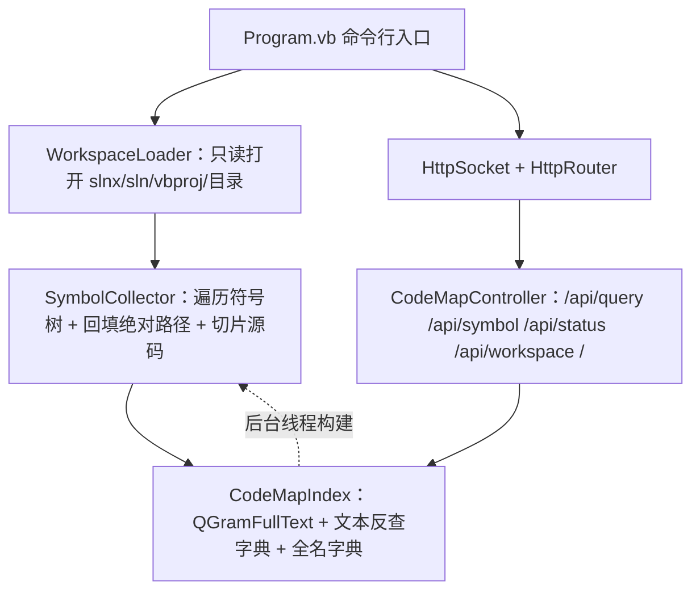

## 产品概述

在 `g:\DevAgent\src\CodeMap\CodeMap.vbproj` 中构建一个只读的"代码地图"索引服务：以只读方式打开一个代码库工作区（git 文件夹 / `.vbproj` 项目 / `.sln` 或 `.slnx` 解决方案），把工作区建模为"代码文件 → 符号列表"，基于符号的 `SourceLocations` 定位其定义源码并构建全文索引，最后以 HTTP 服务形式对外提供代码符号的关键词查询能力，返回命中的代码片段。

## 核心功能

- **只读工作区加载**：根据传入路径自动判别类型并打开——`.sln`/`.slnx` 解决方案、`.vbproj` 项目、普通目录（git 代码库文件夹）；统一通过 `IProjectWorkspace` 抽象枚举其中的 VB.NET 代码文件。
- **符号建模**：解析每个代码文件得到符号列表（Namespace/Class/Module/Structure/Enum/Interface/Function/Sub/Property/Event/Delegate/Variable），记录符号全名、种类、修饰符、XML 注释以及定义所在的绝对路径与行号范围（`SourceLocations`），并据此一次性取出定义的源代码片段。
- **符号全文索引**：基于 `QGramFullText` 建立符号级 Q-Gram 索引，支持关键词模糊检索并按相似度排序。
- **HTTP 查询服务**：基于 Flute 提供 `GET/POST /api/query?q=&top=&threshold=` 关键词检索、`GET /api/symbol?fullname=` 按全名取定义源码、`GET /api/status` 索引状态、`GET /api/workspace` 工作区信息，以及 `GET /` 内置查询网页。
- **后台服务形态**：CodeMap 改为控制台程序，命令行传入 `--workspace`/`--port` 等参数；HTTP 服务立即启动，索引在后台线程全量构建，构建未完成时查询接口返回 503 与构建进度。

## 边界与约束

- 全程只读，不写入、不修改被索引的代码库。
- 索引纯内存，不做磁盘缓存，重启需重新解析。
- 保留既有 WinForms 代码（`FormTreeMap`）不做改动。

## 技术栈选择

- 语言/框架：VB.NET，.NET 10（`net10.0-windows`），沿用 `CodeMap.vbproj` 既有的三个 ProjectReference（Flute、Microsoft.VisualBasic.Core、VisualStudio.NET5）。
- 工作区与符号解析：`Microsoft.VisualBasic.ApplicationServices.Development.VisualStudio`（`Solution` / `SolutionWorkspace` / `VBProject` / `FolderWorkspace` / `IProjectWorkspace` / `VBParser` / `LanguageSymbolType`）。
- 全文索引：`Microsoft.VisualBasic.ComponentModel.DataSourceModel.Repository.QGramFullText`（+ `FindResult`）。
- HTTP 服务：`Flute.Http.Core.HttpSocket` + `HttpRouter`（特性路由 `HttpGet`/`HttpPost`）+ `Flute.Http.Configurations.Configuration`。
- 内置查询页：服务端内联生成的单页 HTML（无前端框架、无构建步骤）。

## 实现方案

### 总体策略

把"工作区建模 → 符号采集 → 索引构建 → HTTP 暴露"拆成四层，每层只依赖下一层的接口，便于后续替换索引实现或增加 LSP 输出：



### 关键技术决策

1. **不直接用 `SolutionWorkspace.GetCompileFiles()` 做定位**：它把所有项目的相对路径混在一个序列里，跨项目后无法还原绝对路径。改为遍历 `Solution.Projects`（`Project.FullPath` 已是绝对路径）逐个 `VBProject.Load`，同时保留 `sln.LoadWorkspace()` 作为 `GetSymbol(fullName)` 的兜底查询入口。
2. **`VBProject.ParseDoc` / `FillSourceFilePath` 是 Private**，外部不能调用。因此：

- sln/slnx/vbproj 场景：复用 `VBProject.Load(path, parseDoc:=True)`，它已把绝对路径回填进 `Source.FilePath`，直接读 `CompileFiles(i).Types`。
- 目录（git 仓库）场景：`FolderWorkspace` 不做解析，需自行 `VBParser.Parse(code)`（Public）并写一个等价的 walk 把绝对路径写入 `Source.FilePath`。

3. **`QGramFullText.Add` 不返回 docId，`Search` 只回 `FindResult.text`**。因此自建 `Dictionary(Of String, List(Of CodeSymbol))`，以"加入索引的文本"为 key 做反查，把命中结果映射回符号条目；同文本多个符号用 List 承载。
4. **不用 `Source.CodeBlock`**：该属性每次访问都整文件读盘。构建期维护一份"文件 → 行数组"的临时缓存，按 `FilePath + LineRange` 自行切片，切完即弃，避免 105 个项目级别下重复 I/O。
5. **索引粒度与内存控制**：符号级（而非文件级）；索引文本 = 符号全名 + 声明行 + 源码片段，源码片段按最大行数截断（默认 200 行，可配），避免大文件撑爆内存。
6. **先起服务后建索引**：HTTP 立即监听，`/api/query`、`/api/symbol` 在索引未就绪时返回 503 + 当前进度，`/api/status` 可轮询；用 `SyncLock` 保护状态字段与索引引用（构建期用临时对象，完成后原子替换）。
7. **单个项目解析独立 Try/Catch**，坏项目只记警告不中断整体索引。

### 复杂度与瓶颈

- 构建期：O(文件数 × 单文件解析成本)，105 个项目全量解析是主要瓶颈 → 后台线程 + 进度反馈 + 逐项目容错。
- 查询期：`QGramFullText.Search` 对每个查询词做 Q-Gram 相似候选查找并按文档累加相似度，与索引词表规模相关；`top` 默认 20 限制返回条数。
- 内存：符号条目数 ×（全名 + 截断源码），截断是主要降压手段。

## 实现要点（执行细节）

- `CodeMap.vbproj` 改控制台：`<OutputType>Exe</OutputType>`、`<StartupObject>CodeMap.Program</StartupObject>`；**必须保留** `<MyType>WindowsForms</MyType>`（改为 `Console` 会让 `My Project\Application.Designer.vb` 里 `OnCreateMainForm` 的重写失效而编译失败），保留 `UseWindowsForms`/`UseWPF`，`FormTreeMap*` 文件不动。
- 根命名空间为 `CodeMap`（vbproj 未声明 `RootNamespace`）。
- 关键 Imports：`...VisualStudio.VBProj`、`...VBProj.CodeDOM`、`...VBProj.CodeDOM.Syntax`、`...VisualStudio.sln`、`Microsoft.VisualBasic.ComponentModel.DataSourceModel.Repository`、`Flute.Http.Core`、`Flute.Http.Core.Message`、`Flute.Http.Core.Message.HttpHeader`、`Flute.Http.Configurations`、`Microsoft.VisualBasic.Net.Http`（`HTTP_RFC`）。
- Flute 用法要点：`New HttpRouter(controller)` → `New HttpSocket(router, port, configs:=New Configuration With {.silent = False})` → `socket.Run()`（阻塞）；`Console.CancelKeyPress` 里 `e.Cancel = True : socket.Shutdown()`；`res.WriteJSON(Of T)(obj)` 已自动设置 Content-Type，**不要**再手写 header；跨域需显式设 `res.AccessControlAllowOrigin = "*"`；取参用 `req("q")`（GET/POST 通吃）。
- 目录模式需排除 `bin`、`obj`、`.git`、`.vs`、`My Project`、`node_modules` 等目录（`ProjectFiles.IsExcludedByDefault` 是 Friend，外部需自行实现等价过滤）。

## 架构设计

- `WorkspaceLoader`：只读打开，产出 `WorkspaceInfo`（名称、类型、根路径、项目清单、已解析的 `VBProject()`、`IProjectWorkspace` 句柄）+ 待解析源文件清单 `(绝对路径, 相对路径, 项目名)`。
- `SymbolCollector`：符号树遍历（容器 `InternalNested`/`Members`，成员 `Locals`）、全名拼接（沿 `Parent` 链，visited 集合防环）、按文件行缓存切片源码，产出 `CodeSymbol`。
- `CodeMapIndex`：持有 `QGramFullText`、文本反查字典、全名/短名字典、构建状态；`BuildAsync` 后台构建、`Query`、`FindSymbol`、`Status`。
- `CodeMapController`：`HttpRouter` 特性路由控制器，只做参数校验与 JSON 输出。
- `IndexPage`：返回内置 HTML 查询页（后端渲染，含简单 CSS/JS，向 `/api/query` 发请求）。

## 目录结构

```
g:/DevAgent/src/CodeMap/
├── CodeMap.vbproj                       # [MODIFY] OutputType 改 Exe、StartupObject 改为 CodeMap.Program；其余属性与项目引用保持不变
├── Program.vb                           # [NEW] 控制台入口：解析 --workspace/--port/--q/--top/--threshold/--max-lines，打印用法，端口占用检查，启动后台索引构建与 HttpSocket，主线程阻塞 Run()
├── CodeIndex/
│   ├── WorkspaceLoader.vb               # [NEW] 只读打开工作区：按扩展名分派 .slnx/.sln（Solution.Load → 遍历 Projects → VBProject.Load）、.vbproj（VBProject.Load）、目录（FolderWorkspace + 递归枚举 *.vb 并排除 bin/obj/.git 等）；产出 WorkspaceInfo 与源文件清单
│   ├── CodeSymbol.vb                    # [NEW] 索引条目与结果模型：CodeSymbol（Id/Name/FullName/Kind/Modifiers/Project/File/RelativeFile/StartLine/EndLine/DeclarationLine/XmlDoc/Code）、QueryHit、IndexStatus、WorkspaceInfo
│   ├── SymbolCollector.vb               # [NEW] 符号树遍历与源码切片：递归 InternalNested/Members/Locals，拼接全名，按文件行缓存按 LineRange 切片（不使用 Source.CodeBlock），产出 CodeSymbol 列表；目录模式提供 VBParser.Parse 后的 FilePath 回填
│   └── CodeMapIndex.vb                  # [NEW] 符号索引：QGramFullText 引擎 + 文本→符号反查字典 + 全名/短名字典；后台全量构建（逐项目 Try/Catch、进度回调）、Query、FindSymbol（含 SolutionWorkspace/VBProject.GetType 兜底）、Status、SyncLock 线程同步
├── HttpService/
│   ├── CodeMapController.vb             # [NEW] Flute 路由控制器：<HttpGet("/")>、<HttpGet("/api/query")>、<HttpPost("/api/query")>、<HttpGet("/api/symbol")>、<HttpGet("/api/status")>、<HttpGet("/api/workspace")>；统一 CORS、参数校验、503 未就绪与 400 参数错误
│   └── IndexPage.vb                     # [NEW] 内置查询网页：返回单页 HTML（搜索框 + top/threshold 参数 + 结果列表 + 状态条），前端 fetch /api/query 渲染代码片段
└── FormTreeMap.vb / FormTreeMap.Designer.vb / ApplicationEvents.vb / My Project\*   # [不改动]
```

## 关键代码结构

```
' CodeIndex/CodeSymbol.vb —— 索引条目与对外结果模型
Public Class CodeSymbol
    Public Property Id As Integer
    Public Property Name As String          ' 简单名
    Public Property FullName As String      ' Namespace.Type.Member，沿 Parent 链拼接
    Public Property Kind As String          ' SymbolType 的字符串形式
    Public Property Modifiers As String
    Public Property Project As String       ' 所属项目名（解决方案场景）
    Public Property File As String          ' 定义所在文件绝对路径
    Public Property RelativeFile As String
    Public Property StartLine As Integer
    Public Property EndLine As Integer
    Public Property DeclarationLine As Integer
    Public Property XmlDoc As String
    Public Property Code As String          ' 定义源码片段（按最大行数截断，构建期一次性读取）
End Class
```

```
' CodeIndex/CodeMapIndex.vb —— 索引与查询契约
Public Class CodeMapIndex
    Public Function Build(ws As WorkspaceInfo,
                          files As IEnumerable(Of SourceFile),
                          Optional onProgress As Action(Of Integer, Integer, String) = Nothing) As Task
    Public Function Query(q As String, Optional top As Integer = 20,
                          Optional threshold As Double = 0) As QueryHit()
    Public Function FindSymbol(fullName As String) As CodeSymbol()
    Public ReadOnly Property Status As IndexStatus   ' Ready / Building / Failed，含进度与符号总数
End Class
```

```
' HttpService/CodeMapController.vb —— 路由契约（签名须严格为 Sub(HttpRequest, HttpResponse)）
Public Class CodeMapController
    <HttpGet("/")>            Public Sub Index(req As HttpRequest, res As HttpResponse)
    <HttpGet("/api/query")>   Public Sub Query(req As HttpRequest, res As HttpResponse)
    <HttpPost("/api/query")>  Public Sub QueryPost(req As HttpPOSTRequest, res As HttpResponse)
    <HttpGet("/api/symbol")>  Public Sub Symbol(req As HttpRequest, res As HttpResponse)
    <HttpGet("/api/status")>  Public Sub Status(req As HttpRequest, res As HttpResponse)
    <HttpGet("/api/workspace")> Public Sub Workspace(req As HttpRequest, res As HttpResponse)
End Class
```

## 设计风格

面向开发者的单页代码检索工具，采用深色（Dark IDE）主题 + 玻璃拟态卡片，青蓝渐变作为主色，整体简洁、专业、响应迅速。

## 页面规划（仅 1 个页面：内置查询首页 `/`）

- **顶部标题栏**：左侧 CodeMap 徽标与工作区名称；右侧显示索引状态徽标（构建中/就绪）与端口信息。
- **搜索区**：大号圆角搜索框（自动聚焦）、右侧"搜索"按钮；下方一行折叠的高级参数（返回条数 top、相似度阈值 threshold）。
- **结果列表区**：以卡片流展示命中项，每张卡片含符号全名 + 种类标签 + 相似度、文件路径与行号、以及等宽字体的代码片段（带语法高亮的浅色底）；支持点击全名跳转 `/api/symbol` 拉取完整定义。
- **底部状态条**：显示命中数、耗时（毫秒）、索引符号总数与错误提示（如 503 构建中）。
- 交互：输入时 300ms 防抖自动联想查询；卡片悬浮上浮 + 边框发光；结果骨架屏与加载动画。

## 响应式

桌面端两栏（左侧固定搜索区、右侧结果流），窗口宽度小于 900px 时堆叠为单栏，搜索区吸顶。

## Agent Extensions

### SubAgent

- **code-explorer**
- Purpose：在实现 HTTP 层与索引层时，精确核对 Flute（`HttpRouter.Register` / `HttpGet` 特性 / `HttpResponse.WriteJSON` / `HTTP_RFC` 枚举）与 VisualStudio（`VBParser` / `Solution.Load` / `Project.FullPath`）的实际签名与命名空间，避免编译期符号解析错误。
- Expected outcome：产出准确的 Imports 清单与方法签名，使 `CodeMapController.vb`、`CodeMapIndex.vb` 一次编译通过。