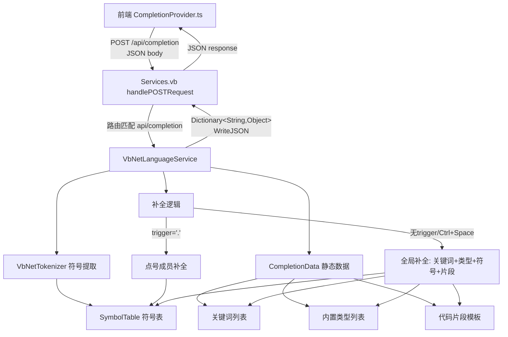

## 产品概述

在现有的 VB.NET HTTP 服务项目（src\LanguageServer）基础上，实现一个针对 VB.NET 语言的基础智能提示和代码补全语言服务后端。该服务通过 REST API 与前端代码编辑器（code-editor）通信，遵循 about.html 中定义的 POST /api/completion 接口契约。

## 核心功能

- **POST /api/completion 路由处理**：接收前端发送的 JSON 请求体（包含 language, text, line, column, trigger 字段），返回 JSON 响应（包含 items 数组，每个 item 含 label, kind, detail, documentation, insertText）
- **VB.NET 关键词补全**：提供完整的 VB.NET 关键词列表，包括控制流、声明、修饰符等
- **VB.NET 内置类型补全**：提供 Boolean, Integer, String, Double 等内置类型
- **代码片段补全（Snippet）**：提供 If/End If、For/Next、Class/End Class 等常用代码结构模板
- **文档符号提取**：解析当前文档文本，提取已定义的类、模块、函数、子过程、属性、变量等符号，加入补全候选列表
- **点号触发补全（`.` trigger）**：识别点号前的标识符，查找其类型，返回该类型的成员列表（基础实现）
- **CORS 支持**：在响应中设置 Access-Control-Allow-Origin 头，确保前端跨域请求正常工作

## 技术栈

- **语言**：VB.NET（net10.0）
- **HTTP 框架**：Flute.Http（GCModeller 项目中的 HTTP 服务器库）
- **JSON 序列化**：Microsoft.VisualBasic.Serialization.JSON（GetJson / LoadJSON 扩展方法）
- **项目引用**：Flute.NET5、Microsoft.VisualBasic.Core、JSON-netcore5、Rsharp-netcore5

## 实现方案

### 整体策略

在现有 `Services.vb` 的 `handlePOSTRequest` 中添加路由分发逻辑，当 URL 路径为 `api/completion` 时，将请求转发给新建的 `VbNetLanguageService` 类处理。`VbNetLanguageService` 负责解析请求、分析文档、生成补全项列表，并通过 `Dictionary(Of String, Object)` 构建响应（确保 JSON 字段名为 camelCase）。

### 关键技术决策

**1. JSON 字段名控制 —— 使用 Dictionary 而非强类型类**

- 前端期望 camelCase 字段名（`items`, `label`, `kind`, `detail`, `documentation`, `insertText`）
- VB.NET 的 `GetJson()` 默认序列化属性名为 PascalCase，会导致前端无法解析
- 方案：使用 `Dictionary(Of String, Object)` 构建响应对象，键名直接使用小写的 JSON 字段名，确保序列化结果与前端契约完全一致

**2. 无第三方 VB.NET 解析器 —— 自行编写轻量级词法分析器**

- 已确认引用的库中不包含 Roslyn 或任何 VB.NET AST 解析器
- 方案：基于正则表达式 + 逐行扫描实现简单的符号提取器，识别 Class/Module/Function/Sub/Property/Dim 声明
- 复杂度：O(n) 线性扫描，n 为文档行数，性能足够应对单文件补全场景

**3. CORS 处理**

- Flute 的 Preflight 模块已自动处理 OPTIONS 预检请求（当 `Sec-Fetch-Mode: cors` 且存在 `Access-Control-Request-Method` 头时自动返回 204 + CORS 头）
- 但 POST 响应本身仍需设置 `AccessControlAllowOrigin = "*"`，否则浏览器会拦截响应

**4. 点号触发补全策略**

- 提取当前行中 `.` 之前的标识符
- 在文档符号表中查找该标识符的声明类型
- 如果类型是内置类型或有用户定义的类/模块，返回该类型的公共成员
- 对于无法解析的情况，返回空列表或通用成员

## 实现要点

### 性能注意事项

- 符号提取为 O(n) 线性扫描，每次请求重新解析整个文档。对于单文件场景性能可接受
- 关键词/类型/片段列表为 Static 共享变量，初始化一次后复用，避免每次请求重建
- 补全项列表按 prefix 过滤时使用 `String.StartsWith`，避免正则开销

### 日志

- 使用 `Call App.LogException(ex)` 记录异常（Flute 库已有此模式）
- JSON 解析失败时返回空 items 列表而非 500 错误，确保前端能优雅降级

### 向后兼容性

- 保留现有 `handleOtherMethod` 中的 `ctrl/kill` 关闭逻辑
- 保留现有 `parseJSON` 方法
- 不修改 `Program.vb` 入口和项目文件

## 架构设计



## 目录结构

```
src/LanguageServer/
├── LanguageServer.vbproj    # 不修改
├── Program.vb               # 不修改
├── Services.vb              # [MODIFY] 添加 POST 路由分发和 CORS 支持
└── VbNetLanguageService.vb  # [NEW] VB.NET 语言服务：符号提取 + 补全逻辑
```

### 文件详细说明

**Services.vb [MODIFY]**

- 修改 `handlePOSTRequest`：检查 `post.URL.path` 是否为 `api/completion`，若是则调用 `VbNetLanguageService.GetCompletions(post, response)`；否则返回 404
- 在返回 JSON 响应前设置 `response.AccessControlAllowOrigin = "*"` 以支持跨域
- 保留 `parseJSON` 方法和 `handleOtherMethod` 中的现有逻辑不变

**VbNetLanguageService.vb [NEW]**

- **静态数据区**：
- `Keywords` 列表：约 120 个 VB.NET 关键词（参考前端 VbNetHighlighter.ts）
- `BuiltinTypes` 列表：Boolean, Byte, SByte, Char, Date, Decimal, Double, Single, Integer, UInteger, Long, ULong, Short, UShort, String, Object, IntPtr, UIntPtr
- `Snippets` 列表：If/End If, For/Next, For Each/Next, While/End While, Do/Loop, Try/Catch/End Try, Select Case/End Select, Class/End Class, Module/End Module, Function/End Function, Sub/End Sub, Property/End Property, Namespace/End Namespace, Using/End Using 等，insertText 含 `\n` 换行和 `$1` 占位符
- `BuiltinTypeMembers` 字典：String 类型的常用成员（Length, Substring,IndexOf, Contains, Replace, Split, Trim, ToUpper, ToLower 等）、数组成员（Length, Rank, GetLength）、集合成员等
- **符号提取**：
- `ExtractSymbols(text As String) As SymbolTable`：逐行扫描文档，用正则匹配 Class/Module/Structure/Interface/Enum 声明、Sub/Function 声明（含参数和返回类型）、Property 声明、Dim/Const/Static 变量声明
- `SymbolTable` 内部类：包含 Types（类/模块/结构）、Methods（函数/子过程）、Properties、Variables（字段/局部变量）的列表
- 每个 Symbol 记录：名称、类型（Class/Module/Function/Sub/Property/Variable/Field）、返回类型或声明类型、访问修饰符、所属容器
- **补全逻辑**：
- `GetCompletions(post As HttpPOSTRequest, response As HttpResponse)`：主入口，解析 JSON 请求体，提取 language/text/line/column/trigger 字段
- 当 `trigger = "."`：提取点号前的标识符，查找其声明类型，返回该类型的成员
- 当无 trigger 或 Ctrl+Space：返回关键词 + 内置类型 + 文档符号 + 代码片段，并按当前光标位置的单词前缀过滤
- 构建 `Dictionary(Of String, Object)` 响应，通过 `response.WriteJSON` 返回