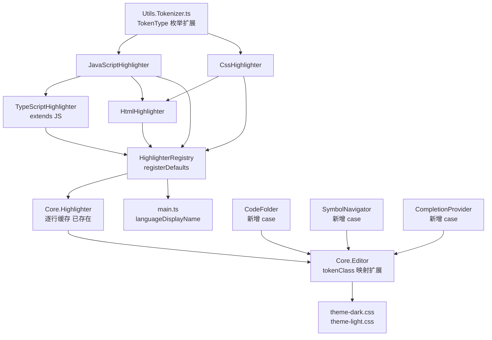

## 用户需求

在现有代码编辑器项目（`index.html` + `src/` 下的 TypeScript 逻辑）的 `src/highlighters` 文件夹中，新增一套完善的 Web 文件语法高亮解析模块，覆盖 JavaScript（.js）、TypeScript（.ts）、HTML（.html）、CSS（.css）四类文件。

经确认，本次交付范围包含以下三点明确要求：

1. 四个高亮器需完整接入编辑器现有配套能力：语言注册表、语言下拉框、文件类型接受列表、代码折叠、符号导航、自动补全。
2. 高亮精度采用「扩展词法类型」方案：新增正则字面量、模板字符串、装饰器、CSS 选择器等细分类型，并同步补充深浅两套主题配色。
3. HTML 内嵌内容采用「委托解析」方案：`<script>` 标签内部交由 JS 高亮器解析，`<style>` 标签内部交由 CSS 高亮器解析，支持跨行状态延续。

## 产品概述

为编辑器补齐前端主流语言的语法着色能力。用户打开或粘贴 js/ts/html/css 文件后，编辑器自动识别语言并渲染彩色高亮；语言下拉框可手动切换；左侧大纲面板列出代码结构；行号槽显示折叠箭头；输入时弹出关键字补全。

## 核心功能

### 语法高亮解析

- **JavaScript**：关键字与控制流关键字分色、跨行块注释、JSDoc 文档注释、单双引号字符串与转义、模板字符串及其 `${}` 插值表达式（含跨行）、正则字面量（与除号歧义消解）、数字（十进制/十六进制/二进制/八进制/科学计数/BigInt）、函数调用与定义名、类名、内置全局对象、属性访问、运算符与标点。
- **TypeScript**：在 JS 基础上叠加类型系统关键字（interface、type、enum、implements、declare、namespace、readonly、abstract 等）、访问修饰符、内置基础类型（string、number、boolean、any、unknown、never、void 等）、类型注解位置识别、泛型参数、装饰器。
- **CSS**：选择器（元素/类/ID/伪类/伪元素/属性选择器）、属性名与属性值分色、颜色值、数值与单位、`!important`、字符串、跨行块注释、at 规则（@media、@import、@keyframes、@supports、@font-face）、自定义属性（CSS 变量）、函数（rgb、var、calc、url 等）。
- **HTML**：文档类型声明、标签名（区分已知标签与自定义标签）、属性名与属性值、实体引用、跨行注释、文本内容；`<script>` 与 `<style>` 区块内部分别委托 JS、CSS 高亮器着色，且状态可跨越任意多行延续。

### 视觉呈现

沿用编辑器现有 Visual Studio 风格配色体系，新增词法类型在深色与浅色两套主题下各自配色，保证与既有语言的着色观感一致（注释绿色斜体、字符串橙色、关键字蓝色、类型青色、函数淡黄等），新增类型如正则、模板字符串、装饰器、CSS 选择器采用与之协调的区分色。

### 配套能力接入

- **语言识别**：按扩展名自动匹配（js/mjs/cjs/jsx、ts/tsx/mts/cts、html/htm/xhtml、css）。
- **语言切换**：下拉框新增四个可选语言项并显示规范名称。
- **文件打开**：文件选择对话框接受上述扩展名。
- **代码折叠**：js/ts/css 按花括号层级折叠，html 按标签配对折叠。
- **符号导航**：JS/TS 提取类、函数、方法、箭头函数变量、接口、枚举、类型别名；CSS 提取选择器与 at 规则；HTML 提取带 id/class 的结构性标签，均按层级组织为树。
- **自动补全**：四种语言各提供内置关键字/属性/标签词表作为无后端时的兜底建议。

## 技术栈

沿用项目既有技术栈，不引入任何新依赖：

- **语言**：TypeScript（`target: ES2019`，`strict: true`，`noImplicitAny: true`，`strictNullChecks: true`）
- **模块组织**：TypeScript `namespace`（`module: "none"` + `outFile` 单文件打包），**非 ES Module**，新增文件不得使用 `import`/`export` 语句，只能用 `namespace CodeEditor.Highlighters { ... }` 加 `import X = Utils.X` 命名空间别名
- **构建**：`tsc` 依据 `tsconfig.json` 的 `files` 有序数组拼接输出 `dist/editor.bundle.js`，根目录 `build.cmd` 触发
- **样式**：原生 CSS 变量 + `body[data-theme="..."]` 主题选择器

## 实现方案

### 总体策略

严格复用现有 `ILanguageHighlighter` 逐行状态机契约。每个高亮器实现 `initialState()` 与 `tokenizeLine(line, state)`，通过不可变的 state 对象在行间传递跨行构造（块注释、模板字符串、CSS 规则块等）。`core/Highlighter.ts` 已有的逐行缓存与增量重解析机制自动生效，无需改动其逻辑。

### 关键技术决策

**1. 为什么手写状态机而非引入 Prism/highlight.js**

项目采用 namespace + outFile 的无模块打包方式，引入第三方 ESM/UMD 库需要改造整个构建链路；且 `core/Highlighter.ts` 的增量缓存要求高亮器暴露「逐行 + 可序列化 state」接口，而主流库均为整段文本解析，无法直接适配。手写状态机与现有 6 个高亮器风格完全一致，零依赖、零构建改动。

**2. JS 正则字面量与除号的歧义消解**

`/` 既可能是除法运算符也可能是正则起始。采用业界通用的「前一个有意义 token 判定法」：在 state 中维护 `lastSignificantToken` 字段，若上一个非空白非注释 token 是标识符、数字、字符串、`)`、`]`、`}` 之一，则 `/` 判为除号；否则判为正则起始。该字段随 state 跨行传递，保证行首出现 `/` 时也能正确判定。这是 O(1) 判定，无回溯开销。

**3. 模板字符串插值的嵌套处理**

模板字符串 `` ` `` 内的 `${}` 可嵌套任意表达式甚至嵌套模板字符串。state 中维护 `templateDepth: number` 与 `braceStack: number[]`，进入 `${` 时压栈，遇到匹配的 `}` 出栈回到模板文本模式。深度用整数记录，state 保持可序列化。

**4. TS 高亮器复用 JS 高亮器（继承而非复制）**

`TypeScriptHighlighter` 继承 `JavaScriptHighlighter`，通过覆写受保护的关键字集合与类型集合注入 TS 特有词汇，并追加装饰器与类型注解识别。避免两份近乎重复的扫描逻辑，符合 DRY。基类需将关键字表设计为 `protected readonly` 成员而非硬编码常量。

**5. HTML 委托解析的状态嵌套设计**

`HtmlHighlighter` 持有 `JavaScriptHighlighter` 与 `CssHighlighter` 实例。state 结构为：

```
{ mode: "html" | "script" | "style", inComment: bool, subState: any, ... }
```

进入 `<script>` 开标签后置 `mode = "script"`，后续行整行交给 JS 高亮器处理并把返回的 state 存入 `subState`；每行先扫描 `</script>` 结束标记，若存在则将该标记之前的片段交给子高亮器、之后切回 html 模式。**关键约束**：子高亮器返回的 token 偏移是相对片段的，必须整体加上片段在行内的起始偏移后再合入，否则渲染错位。`subState` 必须是纯数据对象（现有高亮器 state 均为普通对象字面量，满足要求）。

**6. TokenType 扩展的向后兼容**

新增枚举成员一律**追加到末尾**，绝不插入或重排。因为 `preserveConstEnums: true` 且枚举为数值型，插入会改变既有成员的数值，导致缓存或潜在持久化数据错位。新增：`Regex`、`TemplateString`、`TemplateDelimiter`、`Decorator`、`Selector`、`PseudoClass`、`Unit`、`ColorValue`、`AtRule`、`Variable`、`Builtin`、`TypeParameter`。

### 性能考量

- 单行扫描为单趟 O(n) 字符遍历，无正则回溯风险（避免使用嵌套量词正则）。
- 关键字查找使用 `Set<string>` 而非数组 `includes`，O(1) 命中；关键字集合定义为类的静态成员，全实例共享，避免每次 tokenize 重建。
- HTML 委托时子高亮器实例在构造函数中创建一次并复用，不在 `tokenizeLine` 内 new。
- state 对象使用浅拷贝 `{ ...state, x }`，字段数控制在 10 个以内，拷贝成本可忽略。

### 避免技术债

全部沿用现有范式：`TokenBuilder` 管理偏移、`{ ...state }` 不可变更新、`namespace` + 命名空间别名导入、`switch(language)` 分支扩展 features。不新增任何架构模式。`CodeFolder` 直接复用已有的 `computeBraceBased`（js/ts/css）与 `computeXml`（html），仅加 case 分支，零新增折叠算法。

## 实施要点

- **`tsconfig.json` 的 `files` 数组是有序的**，新增四个高亮器必须插在 `YamlHighlighter.ts` 之后、`HighlighterRegistry.ts` 之前；且顺序必须为 `JavaScriptHighlighter` → `TypeScriptHighlighter`（继承依赖基类）→ `CssHighlighter` → `HtmlHighlighter`（构造时依赖前两者）。顺序错误会导致运行时 `undefined is not a constructor`。
- **`index.html` 的静态 `<option>` 会被清空**：`main.ts` 的 `populateLanguages()` 执行 `innerHTML = ""` 后从 `HighlighterRegistry.listLanguages()` 重建下拉项。因此下拉框新增语言的真正来源是注册表，`index.html` 里的静态 option 仅作无 JS 时的兜底，两处均更新以保持一致。
- **`json`/`jsonc` 扩展名已被 `JsonHighlighter` 占用**，注册 TS 时不要注册这两个扩展，否则会覆盖。
- **`Editor.tokenClass` 的 `default: return ""`**：未映射的新 TokenType 会渲染为无 class 的纯文本（不报错但不着色）。因此扩展枚举后必须同步补全该 switch，否则新类型静默失效。
- **主题 CSS 需改两处**：先在 `body[data-theme="..."]` 块内定义 `--tok-xxx` 变量，再在文件末尾追加 `body[data-theme="..."] .tok-xxx { color: var(--tok-xxx); }` 选择器规则，深浅两个文件同构处理。
- **`SymbolNavigator.levelOf`** 需为新语言选择分级依据：JS/TS 用 `sym.kind`（Class > Function/Method），CSS/HTML 用 `sym.column` 缩进分级，与现有 xml/yaml 一致。
- **`main.ts` 第 271-272 行有默认语言 `vbnet` 硬编码**，本次不改动，保持现有默认行为不变。
- 严格模式下所有变量需显式类型标注，`line[i]` 索引访问在 `strictNullChecks` 下返回 `string` 而非 `string | undefined`（TS 默认不开 `noUncheckedIndexedAccess`），可直接使用，但边界检查仍需手写 `i < n`。

## 架构设计



数据流：文件扩展名 → `HighlighterRegistry.detectFromFilename` → `ILanguageHighlighter` 实例 → `Core.Highlighter.setHighlighter` → 逐行 `tokenizeLine(line, state)` 串行推进并缓存 → `Editor.renderLine` 取 token → `tokenClass` 映射 CSS 类 → 主题 CSS 着色。

## 目录结构

```
code-editor/
├── src/
│   ├── utils/
│   │   └── Tokenizer.ts                        # [MODIFY] 在 TokenType 枚举末尾追加新成员：Regex、TemplateString、
│   │                                           #   TemplateDelimiter、Decorator、Selector、PseudoClass、Unit、
│   │                                           #   ColorValue、AtRule、Variable、Builtin、TypeParameter。
│   │                                           #   严禁插入或重排既有成员。可选：新增共享的 isIdentStart/isIdentPart
│   │                                           #   工具函数供新高亮器复用。
│   ├── highlighters/
│   │   ├── JavaScriptHighlighter.ts            # [NEW] JS 词法状态机。实现 ILanguageHighlighter，language = "javascript"。
│   │   │                                       #   state: { inBlockComment, inDocComment, inTemplate, templateDepth,
│   │   │                                       #   braceStack, lastSignificant }。处理：跨行块注释与 JSDoc、单双引号
│   │   │                                       #   字符串含转义、模板字符串与 ${} 插值（跨行）、正则字面量歧义消解、
│   │   │                                       #   多进制数字与 BigInt、关键字/控制流关键字分色、内置全局对象、
│   │   │                                       #   函数调用名与定义名、类名（大写开头启发式）、属性访问、运算符标点。
│   │   │                                       #   关键字集合定义为 protected static readonly Set 供 TS 子类复用。
│   │   ├── TypeScriptHighlighter.ts            # [NEW] 继承 JavaScriptHighlighter，language = "typescript"。
│   │   │                                       #   覆写关键字集合注入 TS 关键字（interface/type/enum/implements/
│   │   │                                       #   declare/namespace/readonly/abstract/public/private/protected/
│   │   │                                       #   satisfies/asserts 等）与内置类型（string/number/boolean/any/
│   │   │                                       #   unknown/never/void/object/symbol）。追加装饰器 @xxx 识别与
│   │   │                                       #   泛型参数 <T> 识别。不复制基类扫描逻辑。
│   │   ├── CssHighlighter.ts                   # [NEW] CSS 状态机，language = "css"。
│   │   │                                       #   state: { inBlockComment, inRule, inValue, atRuleDepth }。
│   │   │                                       #   区分选择器上下文与声明块上下文：块外为选择器（元素/类/ID/
│   │   │                                       #   伪类/伪元素/属性选择器/组合符），块内 : 前为属性名、后为属性值。
│   │   │                                       #   处理：跨行注释、颜色值（#hex/命名色）、数值+单位、!important、
│   │   │                                       #   字符串、at 规则、CSS 自定义属性 --var、函数 rgb/var/calc/url。
│   │   ├── HtmlHighlighter.ts                  # [NEW] HTML 状态机 + 内嵌委托，language = "html"。
│   │   │                                       #   构造函数中各创建一个 JS/CSS 高亮器实例并复用。
│   │   │                                       #   state: { mode: "html"|"script"|"style", inComment, inTag,
│   │   │                                       #   subState }。script/style 模式下先查结束标记，将片段交子高亮器
│   │   │                                       #   并把返回 token 的 start/end 整体偏移后合入。
│   │   │                                       #   html 模式处理：DOCTYPE、跨行注释、标签名、属性名/值、实体引用、文本。
│   │   └── HighlighterRegistry.ts              # [MODIFY] registerDefaults 追加四行注册：
│   │                                           #   JavaScriptHighlighter -> ["js","mjs","cjs","jsx"]
│   │                                           #   TypeScriptHighlighter -> ["ts","tsx","mts","cts"]（不含 json）
│   │                                           #   CssHighlighter -> ["css"]
│   │                                           #   HtmlHighlighter -> ["html","htm","xhtml"]
│   ├── core/
│   │   └── Editor.ts                           # [MODIFY] tokenClass 方法追加新 TokenType 到 CSS 类名的 case 分支
│   │                                           #   （tok-regex、tok-template、tok-templatedelim、tok-decorator、
│   │                                           #   tok-selector、tok-pseudo、tok-unit、tok-colorvalue、tok-atrule、
│   │                                           #   tok-variable、tok-builtin、tok-typeparam）。保持 default 兜底不变。
│   ├── features/
│   │   ├── CodeFolder.ts                       # [MODIFY] computeFoldRanges 的 switch 追加 case："javascript"、
│   │   │                                       #   "typescript"、"css" 归入已有 computeBraceBased；"html" 归入
│   │   │                                       #   已有 computeXml。注意 computeBraceBased 内部把 # 当注释起始，
│   │   │                                       #   对 js/ts/css 不适用，需为其增加语言参数或跳过 # 判定以免误判。
│   │   ├── SymbolNavigator.ts                  # [MODIFY] extractSymbols 追加 extractJsTs / extractCss / extractHtml
│   │   │                                       #   三个私有方法与对应 case。JS/TS 提取 class、function、method、
│   │   │                                       #   箭头函数常量、interface、enum、type 别名；CSS 提取选择器与 at 规则；
│   │   │                                       #   HTML 提取带 id/class 的结构性标签。levelOf 中 javascript/typescript
│   │   │                                       #   按 sym.kind 分级，css/html 按 sym.column 分级。
│   │   └── CompletionProvider.ts               # [MODIFY] fallbackCompletions 追加四个 case 与对应词表方法，
│   │                                           #   沿用 keywords.map(k => ({ label: k, kind: "keyword", insertText: k }))
│   │                                           #   范式。JS/TS 为关键字与内置对象，CSS 为属性名与常用值，HTML 为标签名与属性名。
│   ├── main.ts                                 # [MODIFY] languageDisplayName 追加四个 case：javascript -> "JavaScript"、
│   │                                           #   typescript -> "TypeScript"、css -> "CSS"、html -> "HTML"。
│   │                                           #   populateLanguages 无需改动（自动从注册表读取）。
├── css/
│   ├── theme-dark.css                          # [MODIFY] 在 body[data-theme="dark"] 块内追加新 --tok-* 变量（VS Code
│   │                                           #   Dark+ 取色），文件末尾追加对应 .tok-* 选择器规则。
│   └── theme-light.css                         # [MODIFY] 同构追加浅色变量与选择器规则（VS 浅色主题取色）。
├── index.html                                  # [MODIFY] 文件输入 accept 属性追加 .js,.mjs,.cjs,.jsx,.ts,.tsx,.mts,
│                                               #   .cts,.html,.htm,.xhtml,.css；language-select 追加四个静态 option
│                                               #   作为兜底（运行时会被注册表重建覆盖）。
└── tsconfig.json                               # [MODIFY] files 数组按依赖顺序插入四个新文件，位置在 YamlHighlighter.ts
                                                #   之后、HighlighterRegistry.ts 之前，内部顺序：JavaScript → TypeScript
                                                #   → Css → Html。顺序错误会导致继承与构造依赖在运行时失败。
```

## 关键代码结构

仅列出跨模块依赖、必须精确约定的两个契约：

```ts
// src/highlighters/JavaScriptHighlighter.ts
// 供 TypeScriptHighlighter 继承复用的受保护扩展点
namespace CodeEditor.Highlighters {
    export interface JsState {
        inBlockComment: boolean;
        inDocComment: boolean;
        inTemplate: boolean;
        /** ${} 插值嵌套深度，0 表示在模板文本中 */
        templateDepth: number;
        /** 用于正则/除号歧义消解的上一个有意义 token 类别 */
        lastSignificant: "value" | "operator" | "none";
    }

    export class JavaScriptHighlighter implements Utils.ILanguageHighlighter {
        readonly language: string = "javascript";
        protected static readonly KEYWORDS: Set<string>;
        protected static readonly CONTROL_KEYWORDS: Set<string>;
        protected static readonly BUILTINS: Set<string>;
        /** 子类覆写以注入语言特有关键字 */
        protected isKeyword(word: string): boolean;
        protected isType(word: string): boolean;
        initialState(): JsState;
        tokenizeLine(line: string, state: JsState): Utils.TokenizeResult;
    }
}
```

```ts
// src/highlighters/HtmlHighlighter.ts
// 内嵌委托的状态契约：subState 必须是纯数据，token 偏移需整体平移
namespace CodeEditor.Highlighters {
    export interface HtmlState {
        mode: "html" | "script" | "style";
        inComment: boolean;
        /** 子高亮器（JS 或 CSS）的跨行状态，纯数据对象 */
        subState: any;
    }
}
```

## Agent Extensions

### SubAgent

- **code-explorer**
- Purpose: 在实现符号导航、代码折叠、自动补全接入时，快速定位 `SymbolNavigator.extractVbNet` / `extractXml`、`CodeFolder.computeBraceBased` / `computeXml`、`CompletionProvider.vbNetCompletions` 等现有同类方法的完整实现，作为新增分支的编码范式参考。
- Expected outcome: 产出这些现有方法的精确实现细节（返回结构、字段填充方式、边界处理），确保新增的 js/ts/css/html 分支与现有代码风格、Symbol 字段语义、FoldRange 构造方式完全一致，避免大纲层级错乱或折叠范围偏移。