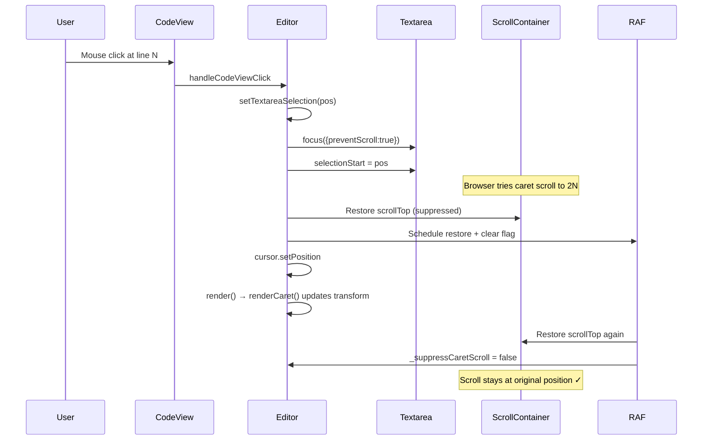

## 用户需求

用户报告代码编辑器存在致命 UI 交互 bug：当使用鼠标点击编辑器中的代码时，编辑器会上下乱跳，导致无法正常使用。需要分析 `src` 文件夹中的源代码，定位根因并修复。

## 产品概述

这是一个基于 TypeScript + DOM 的轻量级代码编辑器，使用隐藏的 `<textarea>` 作为输入层，通过 `transform` 视觉定位光标，配合代码高亮、符号导航、代码折叠、minimap 等功能。编辑器在 WebView2 环境中运行。

## 核心问题

编辑器的 textarea 输入层通过 `transform: translate(col*charWidth, line*lineHeight)` 视觉移到光标行。当程序设置 `textarea.selectionStart` 时，浏览器原生 caret 自动滚动会将 textarea 内 caret 偏移（N*lineHeight）与 transform 偏移（N*lineHeight）叠加，计算出 caret 视觉位置 ≈ 2N*lineHeight，导致滚动容器跳到错误位置。错误滚动又触发 scroll 事件 → render() → renderCaret() 更新 transform → 形成反馈循环，表现为"上下乱跳"。

## 核心功能（修复目标）

- 鼠标点击代码区域定位光标时，编辑器视图保持稳定不跳动
- 键盘导航（方向键移动光标）时，视图正确跟随光标不乱跳
- 输入文字时，视图保持稳定
- 符号导航跳转、Go to Line 跳转时，正确滚动到目标行
- 所有设置 textarea 选区的操作统一通过防跳动机制处理

## 技术栈

- 语言: TypeScript (target: ES2019, module: none, strict mode)
- 构建: tsc 编译器 (build.cmd)，输出到 dist/editor.bundle.js
- 运行环境: WebView2 (Chromium 内核)，支持 `focus({ preventScroll: true })`
- 无第三方依赖，纯 DOM 操作

## 根因分析

编辑器架构使用隐藏 textarea（1px 宽、1 行高、overflow:hidden）+ transform 视觉定位方案。设置 `textarea.selectionStart` 时浏览器原生 caret scrolling 会将 textarea 内 caret 偏移与 transform 偏移叠加，导致滚动到 2N 错误位置。`scroll` 事件处理器被触发后调用 `render()` → `renderCaret()` 更新 transform，与异步 caret scrolling 形成反馈循环。

## 当前修复状态

文件 `src/core/Editor.ts` 已被部分修复：

- 已添加 `_suppressCaretScroll` 标志和 `setTextareaSelection` 方法
- 已在 scroll 事件处理器中添加标志守卫
- `handleCodeViewClick`、`handleGutterClick`、`setText`、`acceptCompletion` 已改用 `setTextareaSelection`

## 残留问题与修复方案

### 问题 1: `setTextareaSelection` 的 rAF 撤销 `scrollToLine`

`setTextareaSelection` 的 `requestAnimationFrame` 始终将 scrollTop 恢复为选区设置前的值。但 `goToSymbol`（第 537 行）和 `goToLineNumber`（第 702 行）在调用 `setTextareaSelection` 后立即调用 `scrollToLine` 设置新滚动位置，rAF 随后将滚动位置恢复为旧值，撤销了 `scrollToLine`。

**修复**: 为 `setTextareaSelection` 添加 `restoreScroll: boolean = true` 参数。当 `restoreScroll` 为 false 时，不在 `finally` 块和 rAF 中恢复滚动位置，但仍设置和清除 `_suppressCaretScroll` 标志。`goToSymbol` 和 `goToLineNumber` 传入 `false`。

### 问题 2: `updateCaretFromTextarea` 未修复

此方法在 textarea `keyup`（键盘导航）和 `click` 时调用。浏览器 caret scrolling 已将滚动位置移到 2N，但此方法未做任何抑制或纠正。

**修复**:

- 在 keydown 事件中保存当前 scrollTop 到 `_savedScrollTop` 字段
- `updateCaretFromTextarea` 中设置 `_suppressCaretScroll = true`，先恢复到 `_savedScrollTop`（按键前位置），再 `render()`，再调用 `scrollToLine(cursor.line)` 确保光标可见
- 在 rAF 中清除 `_suppressCaretScroll` 标志

### 问题 3: `handleInput` 未修复

用户输入时浏览器 caret scrolling 可能导致跳动。

**修复**: 同问题 2 的模式 —— 设置 `_suppressCaretScroll = true`，恢复到 `_savedScrollTop`，`render()`，`scrollToLine`，rAF 清除标志。

### 问题 4: `focus()` 方法未使用 preventScroll

`focus()` 方法（第 924 行）调用 `this.textarea.focus()` 不带参数，可能触发浏览器 focus-induced scrolling。

**修复**: 改为 `this.textarea.focus({ preventScroll: true })`。

## 实现要点

- `focus({ preventScroll: true })` 的 FocusOptions 类型在 ES2019 DOM lib 中可能缺失，但 `skipLibCheck: true` 已启用，且 WebView2（Chromium）原生支持此 API。当前代码已在 `setTextareaSelection` 中直接使用，编译通过，无需类型断言。
- `scrollToLine` 方法逻辑：仅当目标行在可视区域上方或下方时才滚动，若已在可视区域内则不滚动。因此恢复到 `_savedScrollTop` 后调用 `scrollToLine` 可避免不必要的跳动 —— 若光标仍在可视区域内则保持原位，若移出可视区域才滚动跟随。
- rAF 中清除标志的顺序：先恢复滚动位置（此时标志仍为 true，scroll 事件被跳过），再清除标志。确保恢复操作不会触发 render 循环。

## 架构设计



## 目录结构

所有修改集中在单一文件：

```
g:\DevAgent\code-editor\
├── src\core\Editor.ts    # [MODIFY] 修复残留的 caret scrolling 问题
├── build.cmd             # [RUN] 编译 TypeScript 到 dist/editor.bundle.js
└── dist\editor.bundle.js # [OUTPUT] 编译产物，index.html 引用
```

### 修改详情 — `src/core/Editor.ts`

**修改点 1 — `setTextareaSelection` 方法（约第 282 行）**:
添加 `restoreScroll: boolean = true` 参数。在 `finally` 块和 `requestAnimationFrame` 回调中，仅在 `restoreScroll` 为 true 时恢复 scrollTop/scrollLeft。`_suppressCaretScroll` 标志的设置和清除不受 `restoreScroll` 影响。

**修改点 2 — `goToSymbol` 方法（约第 537 行）**:
将 `this.setTextareaSelection(pos)` 改为 `this.setTextareaSelection(pos, undefined, false)`，使 `scrollToLine(symbol.line)` 的滚动位置不被 rAF 撤销。

**修改点 3 — `goToLineNumber` 方法（约第 702 行）**:
将 `this.setTextareaSelection(pos)` 改为 `this.setTextareaSelection(pos, undefined, false)`，同理。

**修改点 4 — 新增 `_savedScrollTop` 字段（约第 91 行附近）**:
添加 `private _savedScrollTop: number = 0;` 字段。

**修改点 5 — keydown 事件监听器（约第 199 行）**:
在调用 `handleKeyDown(e)` 之前保存 `this._savedScrollTop = this.scrollContainer.scrollTop;`。

**修改点 6 — `handleInput` 方法（约第 229 行）**:
设置 `_suppressCaretScroll = true`；在 `buffer.setText` 之前恢复 `this.scrollContainer.scrollTop = this._savedScrollTop`；在 `render()` 之后调用 `this.scrollToLine(this.cursor.position.line)`；在末尾添加 `requestAnimationFrame` 清除 `_suppressCaretScroll`。

**修改点 7 — `updateCaretFromTextarea` 方法（约第 305 行）**:
设置 `_suppressCaretScroll = true`；恢复 `this.scrollContainer.scrollTop = this._savedScrollTop`；`render()` 后调用 `this.scrollToLine(this.cursor.position.line)`；添加 `requestAnimationFrame` 清除标志。

**修改点 8 — `focus()` 方法（约第 924 行）**:
将 `this.textarea.focus()` 改为 `this.textarea.focus({ preventScroll: true })`。