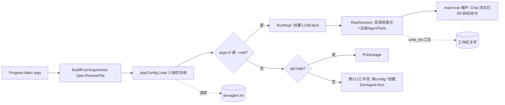

## 产品概述

在现有 DevAgent 命令行程序基础上，新增两种运行能力：交互式 REPL 对话开发模式与基于 INI 文件的配置模块。REPL 模式让用户能以连续上下文对话的方式，借助 LLM agent 在当前文件夹工作区内进行 VB.NET 项目开发辅助；配置模块通过 INI 文件统一管理命令行可选参数的默认值。

## 核心功能

### REPL 交互模式

- 程序启动无任何参数，或以 `--repl` 作为启动参数时，进入 REPL 模式
- REPL 工作区为程序启动时的当前文件夹（Environment.CurrentDirectory）
- 以连续多轮上下文对话形式与 LLM agent 交互，agent 自动维护并裁剪对话记忆
- LLM 通过 function calling 自主调用文件工具读取/浏览/搜索/写入工作区文件（新增 write_file 工具），实现代码改动落地
- 支持斜杠命令：/exit /quit 退出、/clear 清空上下文、/help 帮助、/tree 显示项目树、/cwd 显示工作区
- LLM 响应（思考与正文）流式实时打印到控制台

### INI 配置模块

- 新增 `--config <path>`（短名 -c）指定 INI 文件路径，未指定时默认为程序所在目录下的 devagent.ini
- INI 配置 Program.PrintUsage() 中打印的可选命令行参数：model、url、apikey、max-build-fix、max-run-fix
- 三级优先级：命令行参数 > INI 配置 > 内置默认值
- 首次运行若 INI 文件不存在，自动生成带注释的默认模板，便于用户编辑
- 原命令行工作流同样使用 INI 配置后的值创建 LLM 客户端与选项

## 技术栈

- 语言/平台：VB.NET / .NET 10（沿用现有项目）
- LLM 客户端：复用 Ollama 模块的 `LLMClient`（已内置多轮对话记忆 ChatContextMemory、流式输出、function calling）
- INI 解析：复用 sciBASIC# Core 的 `Microsoft.VisualBasic.ComponentModel.Settings.Inf.IniFile`
- 命令行解析：沿用现有 `Microsoft.VisualBasic.CommandLine` 的 `<Opt>` 标注机制

## 实现方案

### 关键技术决策

1. **REPL 多轮上下文**：直接利用 `LLMClient` 的 `preserveMemory=True`（默认）。创建单个 `LLMClient` 实例，通过 `AddSystemPrompt` 设置系统提示，循环调用 `Chat(userInput)`——框架自动入队用户/助手/工具消息并按 token 上限裁剪，无需自行管理历史。`ChatRound` 内部已 `Console.Write` 流式输出思考与正文，REPL 无需重复打印响应。
2. **代码落地方式（用户已选）**：在 `AgentTools` 新增 `write_file(path, content)` 函数工具，LLM 在对话中通过 function calling 自主写文件。复用现有 `ResolveSafePath` 做工作区内安全检查，自动建父目录后 `File.WriteAllText`。AgentTools 构造新增可选 `logger` 回调，写入成功时反馈。
3. **INI 三级优先级**：因 `Opts` 字段已内置默认值（无法仅凭值区分是否由 CLI 显式提供），通过扫描原始 `args` 数组中是否含 flag token（如 `--model`/`-m`）判定 CLI 是否显式提供；未提供则取 INI 值，INI 也无则回落 `Opts` 默认。
4. **apikey 处理**：`Opts.ResolveFile` 已将空 apikey 默认为 `MyDocuments/.openai.key` 路径，`LLMUrl.Create` 会自动读取该文件首行——此既有行为保留。INI 提供 apikey 时优先用 INI 值。
5. **入口分流**：`args.Length=0` 或 `opt.repl=True` → REPL；`opt.help` → PrintUsage；其余走原 CLI 工作流（改用 AppConfig 解析值）。

### 性能与可靠性

- REPL 每轮对话 try/catch 包裹，网络错误不中断会话，打印错误后继续
- `LLMClient` 默认 1M token 上限自动裁剪，长会话无内存泄漏风险
- `LLMClient` 实现 IDisposable（持有 ChatContextMemory 日志 StreamWriter），REPL 用 `Using` 包裹释放
- `write_file` 复用 `ResolveSafePath` 安全检查，禁止越界写工作区外文件
- AgentTools 构造新增可选参数，对现有 `DevAgent.vb` 中 `New AgentTools(_projectPath)` 调用完全向后兼容

### 架构关系



## 目录结构

工作区根：`g:\DevAgent\src\DevAgent`

```
g:\DevAgent\src\DevAgent\
├── Program.vb                 # [MODIFY] 入口分流：判定 REPL/CLI；加载 AppConfig；新增 RunRepl；PrintUsage 增补 --repl/--config/INI 说明；原 CLI 流程改用 config.* 值
├── Opts.vb                    # [MODIFY] 新增 <Opt("--repl")> repl As Boolean 与 <Opt("--config","-c")> configFile As String
└── src/
    ├── AppConfig.vb           # [NEW] 配置模块：AppConfig 类(Model/Url/ApiKey/MaxBuildFix/MaxRunFix/IniPath/ConfigSource) + Shared Load(args,opt) 三级优先级解析(用 IniFile.ReadValue) + WriteTemplate(path) 生成默认模板
    ├── ReplSession.vb         # [NEW] REPL 会话：构造(ollama,workspace,logger)；AddSystemPrompt 设系统提示；注册 AgentTools(含write_file)；Async Run() 读行循环+斜杠命令(/exit/quit/clear/help/tree/cwd)+Chat 流式
    ├── AgentTools.vb          # [MODIFY] 构造新增 Optional logger As Action(Of String)；新增 write_file(path,content) 工具(<Description>/<Argument> 标注、复用 ResolveSafePath、建目录、File.WriteAllText、logger 回调)
    ├── Configs.vb             # [不变] DevAgentOptions / CodeFile
    ├── DevAgent.vb            # [不变] 自动化工作流 agent
    ├── ProcessHelper.vb       # [不变]
    └── ProcessResult.vb       # [不变]
```

## 关键代码结构

AppConfig 三级优先级解析核心（接口级示意）：
```vb.net
' src/AppConfig.vb
Public Class AppConfig
Public Property Model As String
Public Property Url As String
Public Property ApiKey As String
Public Property MaxBuildFix As Integer
Public Property MaxRunFix As Integer
Public Property IniPath As String
Public Property ConfigSource As String  ' 启动横幅描述各值来源

' 三级优先级：CLI(显式提供) > INI > Opts内置默认
Public Shared Function Load(args As String(), opt As Opts) As AppConfig
' 1. 定位 IniPath：opt.configFile 非空用之，否则 AppContext.BaseDirectory/devagent.ini
' 2. 文件不存在时 WriteTemplate(iniPath) 写带注释默认模板
' 3. Using ini As New IniFile(iniPath)
'      对 model/url/apikey/max-build-fix/max-run-fix：
'        cliProvided = HasFlag(args, longFlag, shortFlag)
'        value = If(cliProvided, opt对应值, 解析ini.ReadValue("devagent",key,default) 失败回落opt默认)
End Function

Private Shared Function HasFlag(args As String(), longFlag As String, shortFlag As String) As Boolean
' 扫描 args 小写匹配 longFlag/shortFlag token
End Function
End Class

```

write_file 工具签名（接口级示意）：
```vb.net
' src/AgentTools.vb — 新增
<Description("Write content to a file in the project. Creates parent directories. Overwrites existing files. Returns success or error message.")>
Public Function write_file(
    <Argument("path", Description:="File path relative to project root, e.g. 'src/Module1.vb'")> path As String,
    <Argument("content", Description:="The full text content to write to the file")> content As String
) As String
    ' fullPath = ResolveSafePath(path)；建父目录；File.WriteAllText；logger回调；返回成功/错误串
End Function
```

INI 默认模板结构：

```
[devagent]
; Ollama/LLM model name (CLI --model overrides)
model=llama3.2
; LLM API URL (CLI --url overrides)
url=http://localhost:11434
; API key, can be a key string or path to a key file (CLI --key overrides)
apikey=
; Max build fix attempts (CLI --max-build-fix overrides)
max-build-fix=8
; Max runtime fix attempts (CLI --max-run-fix overrides)
max-run-fix=5
```

## 实施备注

- **流式输出复用**：不要在 REPL 中再次打印 `response.output`——`ChatRound` 已流式写到控制台，重复打印会出现双份。仅打印思考分隔与每轮结束换行即可。
- **token 统计噪音**：`ChatContextMemory.Enqueue` 每次入队会打印 token 统计到控制台，属框架既有行为，本任务不修改框架。
- **向后兼容**：AgentTools 构造新参为 Optional，`DevAgent.vb` 中 `New AgentTools(_projectPath)` 调用无需改动；`DevAgent.vb` 本任务不修改。
- **apikey 文件读取**：`LLMUrl.Create` 在 apikey 为已存在文件路径时自动读首行，故 Opts.ResolveFile 默认设为 `.openai.key` 路径的既有行为在 REPL 中同样生效。