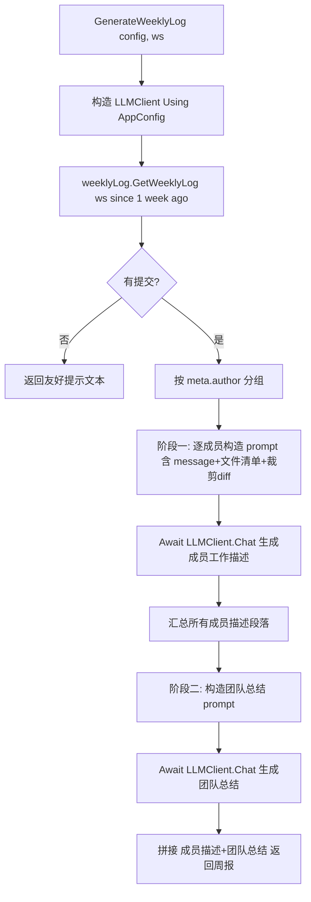

## 产品概述

完善 DevAgent 项目中的 `src\Git\GitWeeklyLog.vb` 模块，提供一个公共异步函数，用于解析指定 git 工作区过去一周内的全部提交历史，借助 LLM 生成团队工作周报文本。周报先按团队成员分别描述工作内容，最后再做团队整体工作任务总结。

## 核心功能

- 调用 GCModeller 的 `weeklyLog.GetWeeklyLog` 解析指定工作区过去一周（自 `since:="1 week ago"` 起）的全部提交记录。
- 按提交作者（团队成员）对提交记录分组，提取每位成员的提交说明（message）、改动文件清单（FilePath + ChangeKind）以及关键 diff 行。
- 两阶段 LLM 总结：
- 阶段一：逐成员将提交信息发送给 LLM，生成该成员一周工作描述段落。
- 阶段二：汇总所有成员描述段落再次发送给 LLM，生成团队整体周报总结。
- 在模块内基于 `AppConfig` 构造 `LLMClient` 并调用，返回完整周报文本。
- diff 内容超长时裁剪，避免超出 LLM 上下文；当工作区无提交记录时返回友好提示文本，不抛异常。

## 技术栈

- 语言：VB.NET（.NET 10）
- LLM 客户端：Ollama 模块中的 `LLMClient`（构造方式 `LLMUrl.Create(url, apikey)` → `New LLMClient(server, model)`；调用 `Await client.Chat(prompt)` 返回 `LLMsResponse`，结果取 `.output`）
- 数据来源：`Microsoft.VisualBasic.ApplicationServices.Development.VisualStudio.VersionControl.Git` 命名空间下的 `weeklyLog.GetWeeklyLog`、`commitEntry`、`log`、`DiffResult`、`FileChange` 等类型（来自 GCModeller 项目引用，已确认字段）
- 配置：`AppConfig`（Url / Model / ApiKey）

## 实现方案

### 总体策略

在 `GitWeeklyLog.vb` 模块内实现两阶段 LLM 总结流程：先按作者分组提取结构化提交信息，再逐成员生成工作描述，最后汇总成团队周报。模块内部基于传入的 `AppConfig` 构造独立的 `LLMClient` 实例（遵循 `Program.vb` 中 `CreateOllamaClient` 的模式，使用 `Using` 确保释放）。

### 关键技术决策

1. **模块内构造 LLMClient**：当前函数仅接收 `AppConfig` 却未创建客户端，无法真正调用 LLM。参考 `Program.vb` 的 `CreateOllamaClient`，在 `GenerateWeeklyLog` 内部用 `AppConfig.Url/Model/ApiKey` 创建 `LLMClient`，并用 `Using` 包裹，调用结束后自动释放，不在函数外部产生副作用。
2. **两阶段 LLM 调用**（核心需求）：

- 阶段一：对每个作者，将其一周内全部提交的「提交说明 + 改动文件列表 + 精简 diff」拼成 prompt，调用 LLM 生成该成员工作描述（段落文本）。
- 阶段二：将所有成员的工作描述段落合并为一份材料，再次调用 LLM，要求输出团队整体总结（进度、亮点、风险/依赖等）。
最终将「成员描述 + 团队总结」拼接为完整周报返回。

3. **数据素材完整化**：除 `meta.author`、`AddedLines`、`DeletedLines` 外，必须利用 `meta.message`（提交说明）与 `changes.Files`（每个 `FileChange` 的 `FilePath`、`ChangeKind`、以及 `Hunks` 中的关键 diff 行），这些是 LLM 理解编辑内容的核心依据。
4. **diff 裁剪**：`git log -p` 的 diff 可能很大。对每个 commit 的 diff 内容做长度上限截断（例如单个文件 hunk 行数或总字符数上限），参考 `CommitMessageGenerator.vb` 中 `MaxDiffLength` 的裁剪思路，避免 token 超限导致调用失败。
5. **空数据保护**：`weeklyLog.GetWeeklyLog` 返回空或分组后无作者时，直接返回友好提示文本（如「该工作区在过去一周内没有检测到任何 git 提交记录」），不抛异常、不调用 LLM。

### 性能与可靠性

- 复杂度：提交数 N、作者数 M。阶段一为 M 次 LLM 调用（M ≤ N），阶段二 1 次，整体 O(M) 次网络调用，可接受。
- 瓶颈：LLM 网络往返延迟。缓解：仅对成员做分组调用而非每 commit 调用，减少调用次数；diff 裁剪控制单请求体大小。
- 错误处理：LLM 调用需 `Try/Catch`，单成员调用失败应记录警告并生成占位文本（如「（该成员工作总结生成失败）」），保证周报其余部分仍可用；最终返回拼接结果而非整体中断。

## 实现注意事项

- 复用现有 `LLMClient.Chat` 返回 `LLMsResponse.output` 的取值方式，与 `DevAgent.vb` 的 `ChatWithLLM` 保持一致。
- 构造 prompt 时使用 `StringBuilder` 拼接，与项目现有 `CommitMessageGenerator.vb`、`DevAgent.vb` 风格一致。
- 不修改 `Program.vb` 调用签名（`config As AppConfig, ws As String`），保持 `Async Function ... As Task(Of String)` 返回类型不变。
- 仅修改 `GitWeeklyLog.vb` 单文件，不改动外部 GCModeller 库、AppConfig.vb、Program.vb。

## 架构设计



## 目录结构

```
src/Git/
└── GitWeeklyLog.vb   # [MODIFY] 重写模块。新增 Imports Ollama 与 Imports Microsoft.VisualBasic.ApplicationServices.Development.VisualStudio.VersionControl.Git（已存在）。实现：
                        - GenerateWeeklyLog：基于 AppConfig 在 Using 内构造 LLMClient；调用 weeklyLog.GetWeeklyLog 解析提交；按 author 分组；
                          构造每位成员的结构化素材（message + 文件清单 + 裁剪 diff 行）；阶段一逐成员调用 LLM 生成工作描述；阶段二汇总调用 LLM 生成团队总结；
                          拼接返回完整周报。空数据时返回友好提示。
                        - 新增私有辅助函数：RenderMemberContext（渲染单成员提交素材）、TruncateDiff（裁剪 diff 内容）、BuildMemberPrompt、BuildTeamPrompt、SafeChat（带 try/catch 的 LLM 调用封装）。
                        - 定义模块级常量（如 MaxDiffChars、MaxMemberPromptChars）控制长度。
```

## 关键代码结构（接口级）

```
' GitWeeklyLog.vb 核心函数签名（保持与 Program.vb 调用一致）
Public Async Function GenerateWeeklyLog(config As AppConfig, ws As String) As Task(Of String)

' 私有辅助：安全调用 LLM，失败时返回降级文本
Private Async Function SafeChat(client As LLMClient, prompt As String, fallback As String) As Task(Of String)

' 私有辅助：将单个成员的提交集合渲染为 LLM 可读文本（含裁剪 diff）
Private Function RenderMemberContext(author As String, commits As commitEntry()) As String
```