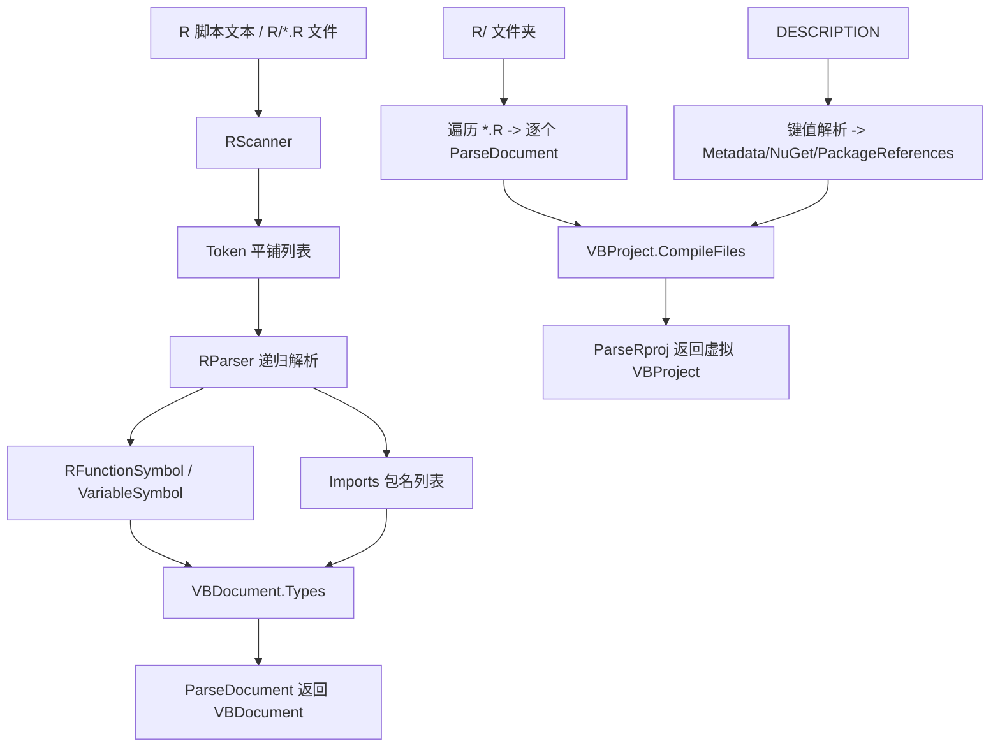

## 用户需求

在 `RLang` 项目中实现一套与 `VBLang\Syntax\VBParser.vb` 功能类似的 R 语言代码解析模块，将 R 脚本解析为符号模型，并把由多份脚本组成的 R 程序包解析为虚拟的 VB.NET 项目对象。

## 核心功能

- **单文件解析（`ParseDocument`）**：读取一段 R 脚本文本，输出 `VBDocument`，其中：
- 顶层（最外层）`require(pkg)` 与 `library(pkg)` 调用被映射为 VB.NET 的 `Imports`（包名去引号、去 `::fn` 后缀、忽略 `character.only=TRUE` 等无法静态解析的形式，并去重）。
- 解析出「函数符号列表」：`name <- function(args){...}` 形式的函数（RHS 以 `function` 关键字开头），提取参数名列表，并支持递归解析函数体内部的嵌套函数与局部变量。
- 解析出「变量符号列表」：`name <- value` / `name = value`（非函数体参数传递）形式的顶层变量赋值。
- **辅助访问**：提供 `GetFunctions(doc)` / `GetVariables(doc)`，分别按 `SymbolType.Function` / `SymbolType.Variable` 从 `VBDocument.Types` 过滤，方便直接取得两类列表。
- **项目解析（`ParseRproj`）**：给定 R 程序包内的 `R/` 文件夹路径，递归收集其下所有 `*.R` 文件，逐个解析为 `VBDocument` 并作为虚拟 `VBProject.CompileFiles`；向上定位 `DESCRIPTION` 文件并解析其键值元数据，映射为虚拟 `VBProject` 的 `Metadata`（Title/Type/Encoding/RoxygenNote/URL/BugReports/Language 等）与 `NuGet` 元数据（PackageId/Version/Authors/Description/License/Maintainer/Copyright 等），并将 `Depends`/`Imports`/`Suggests` 中的依赖包映射为 `PackageReferences`，`Sdk` 设为 `R.Package`、`OutputType` 设为 `Library`。

## 技术栈

- 语言/框架：VB.NET（.NET 10，沿用 `RLang.vbproj` 现有 `net10.0` 目标），与 `VBLang` 完全一致。
- 复用类型：`VBLang.Syntax.Token` / `TokenKind`、`VBLang.VBDocument`、`VBLang.VBProject`、`VBLang.VBProjectMetadata`、`VBLang.VBNuGetMetadata`、`VBLang.VBPackageReference`、`VBLang.LanguageSymbolType` 体系（`CallableMemberSymbol`、`VariableSymbol`、`SymbolType`）。
- 项目引用：`RLang` 已 `ProjectReference` 引用 `VBLang` 与 `Microsoft.VisualBasic.Core`，无需新增依赖。

## 实现方案

采用与 `VBParser` 一致的「分词 → 扫描 → 递归下降」策略，但针对 R 语法做适配：

1. **R 分词器（`RScanner`）**：复用 `VBLang.Syntax.Token`，产出平铺、带行号的 `List(Of Token)`；跳过 `#` 注释；处理 `"`/`'`/反引号字符串（`\` 转义，双引号字符串可跨行）；识别赋值运算符 `<-`、`<<-`、`=`、`->`、`->>` 以及括号/花括号/方括号/逗号/分号/`/`:` 等。字符串与注释内的标识符不会被误判。
2. **R 解析器（`RParser`，Module）**：对 Token 做单次线性扫描，维护「圆括号深度」与「花括号深度」。仅在「两者深度均为 0」的位置识别赋值：

- LHS 标识符（剥离 `/`@ `访问后缀）为符号名；`= `仅在圆括号深度为 0 时视为赋值，避免把函数调用实参 `f(a=1)` 误判为变量。
- RHS 首个有效 Token 为 `function` → 函数：提取 `function(...)` 参数名（尊重嵌套括号与默认值的圆括号），并用花括号匹配取出函数体，递归解析其中的嵌套函数（收入 `NestedFunctions`）与局部变量（收入 `Locals`），以支持闭包。
- 否则为变量：使用 `VariableSymbol`（`ValueType=Nothing`，R 无静态类型）。
- 仅在顶层（`isTopLevel=True`）且处于深度 0 时，识别 `require`/`library` 调用并提取首个实参包名，去重后收入 `Imports`。

3. **符号模型（`RSymbols`）**：`RFunctionSymbol : Inherits CallableMemberSymbol`，`Type=SymbolType.Function`，新增 `NestedFunctions As List(Of RFunctionSymbol)`；变量直接复用 `VariableSymbol`。参数/返回值类型均置 `Nothing`。
4. **文档装配**：`ParseDocument` 用 `RScanner`+`RParser` 得到结果，`Imports` 为包名数组，`Types` 字典同时放入 `RFunctionSymbol` 与 `VariableSymbol`（同名变量不覆盖函数）。
5. **项目装配（`ParseRproj`）**：递归收集 `R/*.R`，逐个 `ParseDocument`（FileName 设为相对 `R` 的路径）；定位并解析 `DESCRIPTION`，按既定映射填充 `VBProject` 的 `RootNamespace`/`AssemblyName`/`Metadata`/`NuGet`/`PackageReferences`，返回虚拟项目。

### 性能与可靠性

- 分词与解析均为 O(N) 单次扫描（N 为 Token 数），花括号/圆括号用计数器配对，无回溯；函数体递归深度受源码嵌套深度限制，属正常量级，无额外开销。
- 对 `characters.only=TRUE`、动态包名等无法静态解析的 `library/require` 形式安全跳过；解析失败（如畸形脚本）不抛异常，返回已成功解析的部分，保证健壮性。
- 文档级 `Imports` 与项目级 `PackageReferences` 均去重，避免重复条目。

## 实现注意事项

- 严格保留 `RLang\Parser.vb` 既有公开签名 `ParseDocument(rscript As String) As VBDocument` 与 `ParseRproj(R As String) As VBProject`（`VBDocument`/`VBProject` 为全局类型，直接引用即可，无需 import）。
- 直接复用 `VBLang.Syntax.Token`，不要新建重复 Token 结构，保持与 `VBLang` 一致。
- `VBProject.Metadata` 与 `NuGet` 默认是 `Nothing`，组装时必须 `New` 初始化后再赋值，否则 `Generate()`/`GetType()` 后续使用会空引用。
- DESCRIPTION 解析需处理续行（缩进行归属上一字段）与跨行逗号分隔的 `Imports/Depends/Suggests`；包名需剥离 `R (>= ...)` 与 `(>= x.y)` 版本约束。
- `DESCRIPTION` 定位：优先 `Path.Combine(R, "..", "DESCRIPTION")`，若不存在则向上逐级查找第一个存在的 `DESCRIPTION`。

## 架构设计

整体沿用以 `VBLang` 符号体系为「虚拟 VB 模型」的现有架构，RLang 作为上层解析适配，不改动 `VBLang` 任何代码：



## 目录结构

```
RLang/
├── Syntax/
│   ├── RScanner.vb     # [NEW] R 语言分词器。复用 VBLang.Syntax.Token，跳过 # 注释，处理 " ' ` 三种字符串（\ 转义、双引号可跨行），识别 <- <<- = -> ->> 及括号/{}[]/,$: 等运算符，输出带行号的平铺 Token 列表。
│   ├── RParser.vb      # [NEW] R 语法解析器（Module RParser）。含 RParseResult 结果类；对 Token 做深度感知扫描：深度0处识别赋值与 require/library，函数体花括号匹配递归解析；产出函数符号/变量符号/导入包名。
│   └── RSymbols.vb     # [NEW] R 专属符号。定义 RFunctionSymbol(:CallableMemberSymbol, Type=Function, 含 NestedFunctions)；变量复用 VariableSymbol，不新建冗余类型。
├── Parser.vb           # [MODIFY] 实现骨架中的 ParseDocument / ParseRproj；新增 GetFunctions / GetVariables 辅助；内部含 ParseDescription / FindDescription 等 DESCRIPTION 映射逻辑。
└── RLang.vbproj        # [已就绪] 已引用 VBLang 与 Microsoft.VisualBasic.Core，无需改动（仅确认）。

RLang.Test/
├── Program.vb          # [NEW] 镜像 VBLang.Test。用内联 R 源码断言函数/变量/Imports 数量；用内联/临时 DESCRIPTION 断言 Package->RootNamespace、Version->NuGet.Version、Dependencies->PackageReferences 映射；调用 ParseRproj 验证虚拟 VBProject。
└── test.vbproj         # [NEW] 镜像 VBLang.Test.vbproj，ProjectReference 引用 RLang 与 VBLang。

Languages.slnx          # [MODIFY] 将新增的 RLang.Test 工程加入解决方案（如构建验证需要）。
```

## 关键代码结构

```
' RSymbols.vb —— R 函数符号（复用 VB 的 CallableMemberSymbol，承载嵌套函数）
Public Class RFunctionSymbol : Inherits CallableMemberSymbol
    Public Overrides ReadOnly Property Type As SymbolType = SymbolType.[Function]
    ' 函数体内定义的闭包函数
    Public Property NestedFunctions As List(Of RFunctionSymbol)
End Class

' RParser.vb —— 解析结果容器
Public Class RParseResult
    Public Functions As New List(Of RFunctionSymbol)()
    Public Variables As New List(Of VariableSymbol)()
    Public Imports As New List(Of String)()
End Class

' Parser.vb —— 提供给调用方直接取得两类列表的辅助
Public Function GetFunctions(doc As VBDocument) As List(Of RFunctionSymbol)
Public Function GetVariables(doc As VBDocument) As List(Of VariableSymbol)
```