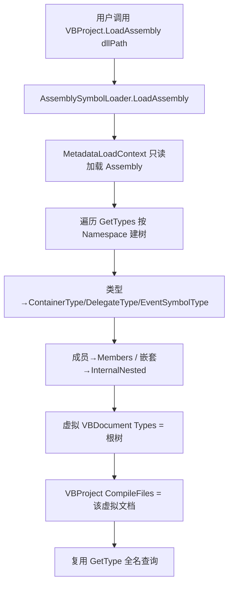

## 用户需求

为 VBLang 项目增加一个反射模块，通过反射只读加载一个 .NET 的 dll 文件，将其中的所有类型符号解析为已有的 `LanguageSymbolType` 符号对象，并把整个 assembly 数据映射为 `VBProject` 对象，使用虚拟的 `VBDocument` 以树形结构存储反射解析出的符号树（不扁平化）。

## 产品概述

新增 `AssemblySymbolLoader` 反射加载器，利用 `System.Reflection.MetadataLoadContext` 仅加载目标程序集元数据（不执行代码），将其类型、成员、嵌套结构逐级映射为 `LanguageSymbolType` 符号树，挂载到虚拟 `VBDocument.Types`，整体封装进 `VBProject`，与现有源码解析（`VBParser.Parse` / `VBProject.Load`）保持一致的树形数据模型与查询接口。

## 核心特性

- 只读元数据加载：使用 `MetadataLoadContext` 加载目标 dll，避免执行目标程序集代码。
- 类型符号映射：Class / Module / Structure / Enum / Interface / Delegate / Namespace 映射为对应 `LanguageSymbolType` 子类，保留泛型参数、继承、接口实现、特性、访问修饰符。
- 成员符号映射：方法（Sub/Function/New/Operator）、属性、字段、事件映射为对应符号，嵌套类型放入 `InternalNested`，成员放入 `Members`，保持树形结构。
- 虚拟文档承载：`VBProject.CompileFiles` 包含一个虚拟 `VBDocument`（`FileName` 为 dll 路径，`Types` 为反射符号树），并复用现有 `VBProject.GetType(fullName)` 按全名查询。

## 技术栈

- 语言/框架：VB.NET，.NET 10（与 `VBLang.vbproj` 的 `TargetFramework=net10.0` 一致）
- 反射加载：`System.Reflection.MetadataLoadContext`（新增 NuGet `PackageReference`，通过 `PathAssemblyResolver` 将运行时目录 + 目标 dll 作为依赖解析路径）
- 复用现有模型：`LanguageSymbolType` 符号类、`TypeInfo`（`Microsoft.VisualBasic.Scripting.MetaData`）、`VBDocument` / `VBProject`
- 测试：复用 `VBLang.Test`（控制台 `Program.vb`）

## 实现方案

采用「只读元数据加载 + 递归符号树构建」策略：用 `MetadataLoadContext` 的 `LoadFromAssemblyPath` 得到 `Assembly`，遍历 `GetTypes()` 按命名空间逐级构建合成命名空间 `ContainerType`（与 `VBParser.Parse` 使用空名 `Namespace` 根一致），再按类型种类映射为 `ContainerType`/`DelegateType`/`EventSymbolType`，最后成员映射进 `Members`、`InternalNested`，整体放入虚拟 `VBDocument.Types` 并封装为 `VBProject`。

关键技术决策：

- **为何用 MetadataLoadContext 而非 `Assembly.LoadFile`**：后者会执行程序集并污染当前 AppDomain，且可能因依赖缺失而失败；MetadataLoadContext 只读取元数据、不执行，最适合“类型探查”。
- **依赖解析**：用 `PathAssemblyResolver` 传入 `{AppContext.BaseDirectory 下 *.dll} + 目标 dll`，保证泛型/基类/接口类型可被解析，且对解析失败的类型做容错（保留全名文本）。
- **树形而非扁平**：严格按 `Type.Namespace` 分层建 `Namespace` 容器，嵌套类型放入父 `InternalNested`，成员放入 `Members`，完全复用 `VBProject.GetType` 既有递归查找逻辑，无需改动查询。
- **XmlDoc 留空**：反射无源码注释信息，本期 `XmlDoc` 置空（架构预留，后续可从伴随 .xml 加载）。

性能与可靠性：类型与成员数量线性遍历 O(N)；`GetTypes()` 一次性取出后本地字典缓存命名空间容器避免重复查找；对无法解析的 `Type` 降级为 `TypeInfo.fullName` 文本，绝不抛异常中断整库解析。

## 实现要点

- 类型→符号映射规则：`IsEnum`→`Enum`（`EnumBaseType`=底层类型）；`IsValueType && !IsEnum`→`Structure`；`IsInterface`→`Interface`；带 `StandardModuleAttribute` 或 `IsSealed && IsAbstract`→`Module`；`IsSubclassOf(Delegate) && !MulticastDelegate`→`DelegateType`（`Parameters`/`ValueType`）；否则 `Class`。
- 成员映射：`.ctor`→`InvokeSymbolType(SymbolType.New)`；`IsSpecialName && name.StartsWith("op_")`→`Operator`；返回 `Void`→`Sub` 否则 `Function`；属性→`InvokeSymbolType(Property)`（索引参数作 `Parameters`，属性类型作 `ReturnType`）；字段→`VariableSymbolType`（`ValueType`）；事件→新增 `EventSymbolType`（`Type=Event`，含 `DelegateType As TypeInfo`）。
- `InheritsType`：取 `BaseType`，跳过 `System.Object`/`System.ValueType`/`System.Enum`；`ImplementsInterfaces`=过滤掉继承接口后的 `GetInterfaces()`。
- `TypeInfo` 按现有 `New TypeInfo With {.fullName = type.FullName}` 构造；泛型参数映射 `GenericTypeArguments`。
- 虚拟 `VBDocument`：`FileName`=dll 全路径，`Imports`=`{}`，`Types`=根命名空间 `InternalNested`。
- `VBProject.LoadAssembly(dllPath)`：复用现有 `VBProject.Load` 静态方法风格，委托 `AssemblySymbolLoader.LoadAssembly`，并设置 `AssemblyName`=程序集名、`OutputType="Library"`、`RootNamespace`=首个命名空间或空。

## 架构设计

现有 `VBProject` 已支持 `CompileFiles(VBDocument())` + `GetType(fullName)` 递归检索。新增反射模块只增加一种“文档来源”（虚拟 dll 文档），不改动既有查询链路。



## 目录结构

```
VBLang/
├── VBLang.vbproj                              # [MODIFY] 增加 PackageReference System.Reflection.MetadataLoadContext
├── LanguageSymbolType.vb                      # [MODIFY] 新增 EventSymbolType 类（Type=SymbolType.Event，含 DelegateType As TypeInfo）
├── VBDocument.vb                             # [MODIFY] VBProject 增加 Shared Function LoadAssembly(dllPath) 包装方法
└── Reflection/
    └── AssemblySymbolLoader.vb               # [NEW] 反射加载 + 递归符号树构建（核心逻辑）
VBLang.Test/
└── Program.vb                                # [MODIFY] 增加 TestReflection()：加载 VBLang.dll，Dump 符号树并断言 GetType 命中已知类型
```

## 关键代码结构

```
' LanguageSymbolType.vb 新增
Public Class EventSymbolType : Inherits LanguageSymbolType
    Public Property DelegateType As TypeInfo
    Public Overrides ReadOnly Property Type As SymbolType
        Get : Return SymbolType.Event : End Get
    End Property
End Class

' AssemblySymbolLoader.vb 核心入口契约
Public Module AssemblySymbolLoader
    Public Function LoadAssembly(dllPath As String) As VBProject
    ' 内部：BuildNamespaceTree / MapType / MapMembers
End Module
```