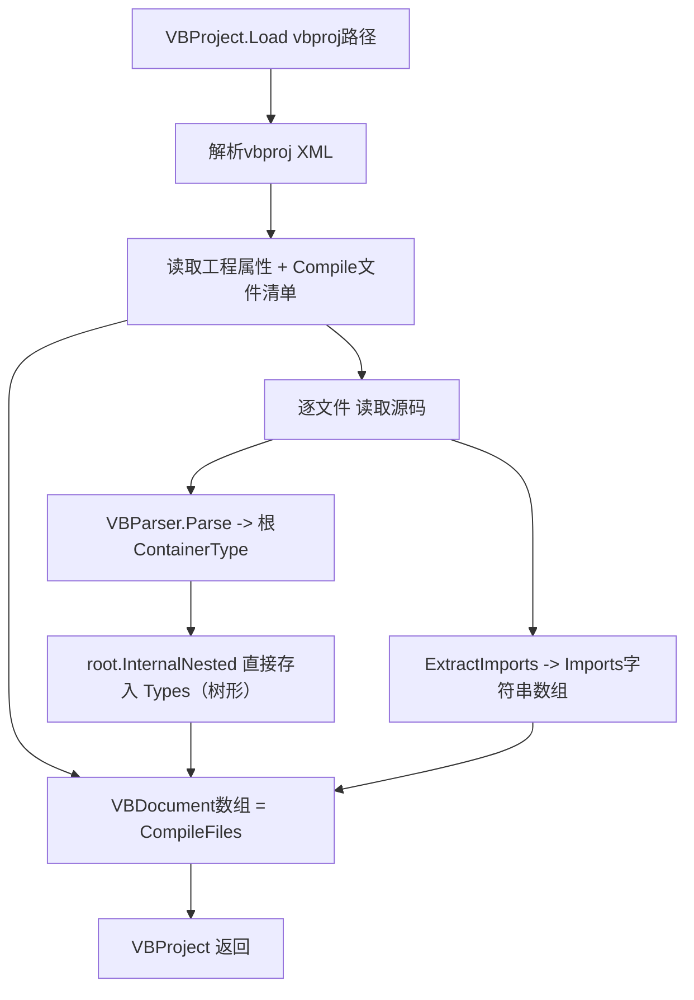

## 用户需求

基于现有的 VB.NET 语法解析模块（VBLang.Syntax.VBParser.Parse），实现一个针对 VB 项目的解析工具，将某个 VB.NET 项目内的所有源代码文件解析为符号树，并采用 VBDocument.vb 中定义的数据结构存储。核心是实现 VBProject.Load 共享函数，专门解析 Microsoft.NET.Sdk 格式的 .vbproj 文件。

## 产品概述

VBProject.Load(vbproj) 读取 SDK 风格 .vbproj，解析工程属性与编译文件清单，逐一读取每个 .vb 源文件，调用 VBParser.Parse 生成符号树，并将根容器下的顶层类型（命名空间与顶层类型）直接存入 Types 字典、保持树形结构，连同每个文件的 Imports 指令列表，封装进 VBProject / VBDocument 数据结构返回。

## 核心功能

- 解析 SDK 格式 .vbproj 的 PropertyGroup（RootNamespace、AssemblyName、OutputType）
- 枚举编译文件：优先使用显式 `<Compile Include>`，否则回退为工程目录下递归 *.vb（排除 obj/、bin/），并应用 `<Compile Remove>` 排除项
- 对每个源文件调用 VBParser.Parse 生成符号树
- 提取每个源文件的 Imports 指令（Parse 会跳过），存入 VBDocument.Imports
- 对每个源文件调用 VBParser.Parse 得到根容器（合成命名空间），将其 InternalNested（顶层命名空间与顶层类型）直接拷入 VBDocument.Types 字典，保留嵌套的树形结构（不再做扁平化）

## 技术栈

- 语言：VB.NET（net10.0），与现有 VBLang 工程一致
- 数据来源：复用 VBLang.Syntax.VBParser.Parse(source) As ContainerType
- XML 解析：System.Xml.Linq（XDocument），处理 MSBuild 命名空间
- 工程结构：单文件修改（VBDocument.vb），无需新增工程或引入新依赖

## 实现方案

实现策略：在现有 VBProject 类（位于 VBDocument.vb，根命名空间 VBLang）中补全 Shared Function Load。Load 依次完成：① 用 XDocument 加载 vbproj，动态获取 MSBuild 命名空间（doc.Root.Name.Namespace）以兼容带命名空间的 SDK 文件；② 读取首个 PropertyGroup 中的 RootNamespace / AssemblyName / OutputType（忽略 Condition）；③ 收集 `<Compile Include>` 与 `<Compile Remove>`；若无 Include 则回退为工程目录递归 `*.vb` 并排除包含 `\obj\`、`\bin\` 的路径；④ 对每个编译文件读取全文，调用 VBParser.Parse 得到根容器（合成命名空间，Name=""），将其 InternalNested 直接存入 Types 字典，保持树形结构；⑤ 用 ExtractImports 单独提取 Imports 行（因 Parse 丢弃指令）。

关键技术决策：

- Types 字典的键为顶层类型的名称（即根容器 InternalNested 的键，如 "DemoApp"），值为对应的 LanguageSymbolType；树形嵌套通过每个符号自身的 InternalNested / Members 保留，不做扁平化，保持与源一致的层级。
- Imports 提取自写轻量逻辑行合并（处理行续接 `_`），直接从源码截取 "Imports" 之后的原始文本，保留 "Namespace" 与 "Alias = Namespace" 两种形态，避免复用分词器重建文本导致的格式失真。
- 根命名空间仅存储于 VBProject.RootNamespace，不向前缀化无显式命名空间的类型键，保持与源结构一致。
- 文件缺失或目录无 .vb 时安全跳过（不抛异常），保证 Load 健壮性。

性能与可靠性：每个文件一次读盘 + 一次 Parse（均为 O(源码规模)），整体为 O(所有源文件总行数之和)，无 N+1 或重复遍历；字典写入用索引赋值（重复键后者覆盖，不会抛异常）。日志复用 VisualBasic 惯例（无需新增日志框架），解析错误由单文件 try/catch 隔离，避免单个文件损坏中断整个工程加载。

## 实现注意事项

- 需在 VBDocument.vb 顶部新增 `Imports VBLang.Syntax`、`Imports System.IO`、`Imports System.Xml.Linq`，不改动现有类与属性定义。
- 注意 `[Imports]` 关键字与 `[Imports]` 类/属性已存在，新增的辅助函数命名避免冲突（用 ExtractImports）。
- 保持对现有 VBDocument / VBProject 公共字段结构零破坏；仅补全 Load 方法体及其私有辅助函数。
- 回退 glob 模式仅当显式 Include 数量为 0 时启用，避免与 SDK 默认包含语义冲突。

## 架构设计

在现有 VBLang 模块内完成，不引入新层。数据流：



## 目录结构

```
g:/DevAgent/src/Languages/
├── VBLang/
│   └── VBDocument.vb        # [MODIFY] 在 VBProject 类中补全 Shared Function Load；新增私有辅助函数
│                            #          ExtractImports(source) As String()；Types 直接存入 root.InternalNested（树形，无需扁平化）。
│                            #          新增 Imports VBLang.Syntax / System.IO / System.Xml.Linq。
│                            #          Load 负责解析 vbproj、枚举 Compile 文件、调用 Parse、
│                            #          组装 VBDocument 数组并返回 VBProject。
└── VBLang.Test/
    └── Program.vb           # [MODIFY] 在 Main 中增加调用 VBProject.Load(../VBLang/VBLang.vbproj)，
                             #          打印工程属性与每个文件的类型数量，作为集成验证（复用现有断言风格输出）。
```

## 关键代码结构

```
' VBDocument.vb 中 VBProject 类新增成员
Public Shared Function Load(vbproj As String) As VBProject

Private Shared Function ExtractImports(source As String) As String()
' 合并续行后提取每个 "Imports" 逻辑行之后的原始文本

Private Shared Function ExtractImports(source As String) As String()
' 合并续行后提取每个 "Imports" 逻辑行之后的原始文本

' 不做扁平化：Types = New Dictionary(Of String, LanguageSymbolType)(root.InternalNested)
' 直接保留根容器下的树形符号结构（顶层命名空间与顶层类型）
```