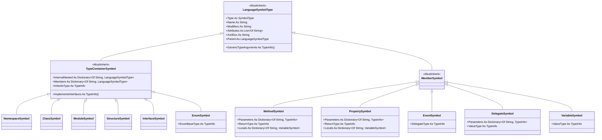

## 用户需求

重构 `VBLang\LanguageSymbolType.vb` 中的代码符号类型系统，使其分类更专业、清晰，重构后不同类别的符号之间不易混淆。

## 产品概述

当前符号系统将「类型容器（类/模块/结构/枚举/接口/命名空间）」「类型成员（方法/属性/事件/委托/字段）」「变量（局部变量与字段混用）」混在一套扁平且 inheritance 错位的类结构中。本次重构引入按职责划分的强类型继承体系，从语法层面杜绝类别误用，并同步更新解析器、反射加载器、文档加载与测试，保证项目可编译、断言全部通过。

## 核心特征

- 建立三类基类：`TypeContainerSymbol`（可承载嵌套类型与成员的类型声明）、`MemberSymbol`（类型成员基类）、`VariableSymbol`（字段与局部变量统一表示，按确认不拆分 Field）。
- 具体类专业化重命名：`ClassSymbol`/`ModuleSymbol`/`StructureSymbol`/`EnumSymbol`/`InterfaceSymbol`/`NamespaceSymbol`、`MethodSymbol`(Function/Sub/Operator/New)、`PropertySymbol`、`EventSymbol`、`DelegateSymbol`、`VariableSymbol`。
- 每个具体类的 `Type` 由类本身固定（不再依赖运行期构造函数抛异常校验），编译期即可区分类别。
- 消除 `Members` 一词两义：容器上的 `Members` 仅表示「类型成员」，方法/属性的局部变量迁移到独立的 `Locals` 集合。
- 移除枚举中无引用的死值 `Field`，避免误导。
- 更新 `VBParser.vb`、`AssemblySymbolLoader.vb`、`VBDocument.vb`、`VBLang.Test/Program.vb` 全部调用点，`VBDocument.Types` 对外接口保持不变。

## 技术栈

- 语言：VB.NET（.NET，现有项目 `Languages.slnx`）
- 现有依赖：`Microsoft.VisualBasic`（TypeInfo/Scripting.MetaData）、`System.Reflection.MetadataLoadContext`（反射加载）
- 不引入任何新框架或库，完全复用现有栈。

## 实现方案

### 总体策略

将扁平且继承错位的符号模型重写为「按职责分类的强类型继承体系」。类别边界由编译器保证，而非运行期 `Throw`；局部变量与方法/属性成员在集合层面彻底分离，避免 `Members` 歧义。

### 关键决策与权衡

1. **三类基类划分**：`LanguageSymbolType`(抽象根) → `TypeContainerSymbol`(可嵌套) 与 `MemberSymbol`(成员)。方法/属性/事件/委托/变量均从 `MemberSymbol` 派生；`InvokeSymbolType : Inherits ContainerType` 的错位被消除——方法不再是「容器」。
2. **`Type` 固定化**：原 `ContainerType` 的 `Type` 属性无 getter 实现、`_Type` 字段缺失且靠构造函数抛异常校验。重构后每个具体类直接 `Overrides ReadOnly Property Type = SymbolType.X`（MethodSymbol 因需 Function/Sub/Operator/New 多变，由构造函数 `Sub New(t As SymbolType)` 设定，基类声明 `MustOverride Property Type`）。误用符号类别在编译期即不可通过，无需运行期异常。
3. **`Members` 与 `Locals` 分离**：容器 `TypeContainerSymbol.Members` 仅存类型成员；`MethodSymbol`/`PropertySymbol` 新增 `Locals As Dictionary(Of String, VariableSymbol)` 存局部变量。彻底消除「`cls.Members("Compute").Members("a")` 表示局部变量」的混淆语义。
4. **Field 与 Variable 合并保留**：按确认，不新增 `FieldSymbol`；字段与局部变量共用 `VariableSymbol`（其 `Parent` 可为 `TypeContainerSymbol` 或 `MethodSymbol`，基类 `Parent As LanguageSymbolType` 包容两者）。枚举死值 `Field` 移除。
5. **枚举分组注释**：`SymbolType` 按「容器 / 成员 / 变量」分组并加注释，提升可读性。

### 性能与可靠性

- 符号树构建为一次性解析，复杂度与源码规模线性相关；字典访问为 O(1)，无新增 N+1 或重复遍历。
- 不引入日志、不触碰文件 IO 与反射执行路径；`MetadataLoadContext` 只读加载逻辑保持不变。
- 爆炸半径控制：对外公开接口 `VBDocument.Types As Dictionary(Of String, LanguageSymbolType)` 与 `VBProject.GetType` 签名不变；仅替换内部具体类型与集合名，调用点全量同步更新，无功能回退。

## 实现要点（防回归）

- 复用现有 `MapContainerSymbol`/`MapMemberSymbol`、`TypeInfoHelper`、`VBScanner`，不重复造轮子。
- `ParseBlock` 的 `member` 参数由 `InvokeSymbolType` 改为 `MemberSymbol`；方法体局部变量写入 `member.Locals`，顶层字段写入 `container.Members`，保持原有「方法体内 Dim 视为局部变量、类型体内视为字段」行为不变。
- `AddToContainer` 的 `Select Case sym.Type` 容器分支（Class/Module/Structure/Enum/Interface/Namespace）条件沿用，仅 `container` 类型由 `ContainerType` 改为 `TypeContainerSymbol`。
- 测试 `Dump` 与断言中 `InvokeSymbolType`→`MethodSymbol`/`PropertySymbol`、`VariableSymbolType`→`VariableSymbol`、`ContainerType`→`TypeContainerSymbol`，局部变量 `.Members`→`.Locals`，probes 字符串及 `GetType().FullName` 断言同步更新为新类名。

## 架构设计



## 目录结构

本次重构影响 5 个文件，均为修改。

```
VBLang/
├── LanguageSymbolType.vb          # [MODIFY] 核心：重写为 SymbolType 枚举 + 三类基类 + 具体符号类的强类型继承体系
├── Syntax/VBParser.vb             # [MODIFY] 解析器调用点改用新类（Parse/ParseBlock/ParseContainerType/ParseInvokeMember/ParseDelegate/DeclareVariables/AddToContainer）及注释更新
├── Reflection/AssemblySymbolLoader.vb  # [MODIFY] 反射加载调用点改用新类（CreateTypeSymbol/MapDelegate/MapMembers/ResolveParent 等）
└── VBDocument.vb                 # [MODIFY] FindInContainer/FindByLastName/Load 中 ContainerType→TypeContainerSymbol
VBLang.Test/
└── Program.vb                    # [MODIFY] 测试断言与 Dump 函数同步新类名、属性名（Locals），probes/FullName 字符串更新
```

## 关键代码结构

```
Public Enum SymbolType
    ' --- 类型容器：可嵌套类型与成员 ---
    [Namespace], [Class], [Module], [Structure], [Enum], [Interface]
    ' --- 类型成员：声明于类型内部 ---
    [New], [Function], [Sub], [Operator], [Property], [Event], [Delegate]
    ' --- 变量：字段与局部变量统一（不拆分 Field）---
    Variable
End Enum

MustInherit Class LanguageSymbolType
    MustOverride Property Type As SymbolType
    Public Name As String
    Public GenericTypeArguments As TypeInfo()
    Public Modifiers As String
    Public Attributes As List(Of String)
    Public XmlDoc As String
    Public Parent As LanguageSymbolType
End Class

MustInherit Class TypeContainerSymbol : Inherits LanguageSymbolType
    Public Property InternalNested As Dictionary(Of String, LanguageSymbolType)
    Public Property Members As Dictionary(Of String, LanguageSymbolType)
    Public Property InheritsType As TypeInfo
    Public Property ImplementsInterfaces As TypeInfo()
End Class

MustInherit Class MemberSymbol : Inherits LanguageSymbolType
End Class

Public Class MethodSymbol : Inherits MemberSymbol
    Public Overrides Property Type As SymbolType
    Public Property Parameters As Dictionary(Of String, TypeInfo)
    Public Property ReturnType As TypeInfo   ' Sub/New 为 Nothing
    Public Property Locals As Dictionary(Of String, VariableSymbol)
    Sub New(t As SymbolType) : Type = t : End Sub
End Class
```