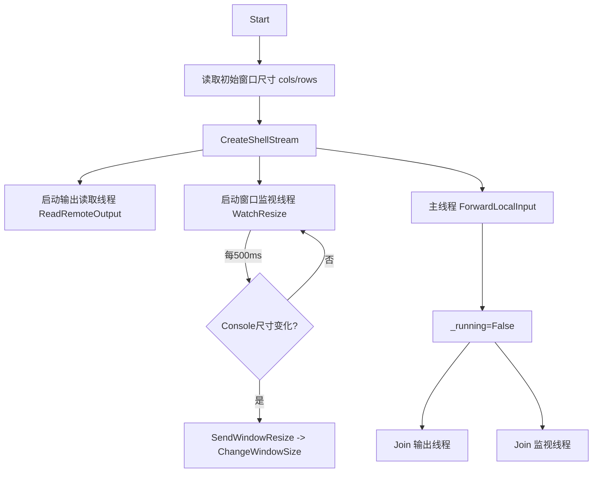

## 用户需求

当前 VB.NET 实现的 SSH 命令行客户端中，终端（伪终端）的屏幕宽度/高度在会话启动后无法随本地 console 窗口尺寸的调整而实时更新，导致远程输出排版错乱、行宽不匹配。

## 产品概述

为交互式 SSH Shell 会话补充"终端窗口尺寸自适应"能力：当用户拖动或调整本地控制台窗口大小时，客户端实时感知变化并通知远程伪终端同步更新行列数，使远程输出的换行与布局跟随本地窗口变化。

## 核心功能

- 会话运行期间持续监视本地控制台窗口尺寸（宽/高）
- 检测到窗口尺寸变化时，通过已有接口将最新行列数发送给远程伪终端（ChangeWindowSize）
- 会话结束时自动退出监视线程，避免资源泄漏
- 非交互式终端（管道重定向、取不到窗口尺寸）时安全降级，不影响原有功能

## 技术栈

- 语言：VB.NET（.NET 10 控制台程序）
- SSH 库：Renci.SshNet（SshClient / ShellStream）
- 线程：System.Threading.Thread（已用于输出读取线程，沿用同一模式）

## 实现方案

### 总体策略

在 `SshShellSession` 中新增一个"窗口尺寸监视线程"，由 `Start()` 在创建 Shell 流后启动；该线程在会话运行期间（`_running = True`）周期性轮询 `Console.WindowWidth/Console.WindowHeight`，与最近一次已知尺寸对比，一旦变化即调用**已存在的** `SendWindowResize(cols, rows)`（其内部调用 `_stream.ChangeWindowSize`）。`Start()` 在线程主循环退出后对该监视线程执行 `Join` 回收。

### 关键技术决策

1. **轮询而非 Win32 事件**：标准 .NET 控制台没有提供托管的"窗口改变事件"。Win32 `ReadConsoleInput` + `WINDOW_BUFFER_SIZE_EVENT` 虽更实时，但需 P/Invoke、复杂且跨平台性差。轮询（~500ms）方案简单、跨平台、零新依赖，且对终端场景延迟可接受（人眼拖动窗口时 500ms 内完成同步）。
2. **复用 `SendWindowResize`**：该方法已实现且含异常保护，直接复用避免重复逻辑，符合 DRY。
3. **复用 `_running` 作为退出标志**：与现有 `ReadRemoteOutput` 线程一致的生命周期管理方式，无新增状态字段的副作用。
4. **记录初始尺寸**：用 `Start()` 中已经取到的 `cols/rows` 初始化 "上次尺寸" 变量，避免启动后立即误触发一次 resize。

### 性能与可靠性

- 轮询间隔 500ms，CPU 占用极低（仅两次整数读取 + 比较）；不阻塞输入/输出线程。
- `Console.WindowWidth/Height` 访问包在 Try/Catch 中，管道/重定向场景安全降级为默认值，不影响会话。
- `SendWindowResize` 已有异常捕获，调整失败（如流已关闭）不会崩溃。
- 监视线程设为 `IsBackground = True`，名称 `ssh-resize-watcher`，与输出线程命名风格一致。
- `Start()` 在 `_running = False` 之后 `Join` 监视线程（带超时），确保退出时线程已回收，无悬挂线程。

### 实现细节（防止回归）

- 仅修改 `SshShellSession.vb` 一个文件，不改动 `Program.vb`、`SshConnection.vb` 等其他模块，控制改动范围（blast radius）。
- 监视线程逻辑与 `ReadRemoteOutput` 保持同一编码风格（Try/Catch + `_running` 退出）。
- 保持终端名称、默认行列、`CreateShellStream` 参数不变，仅追加监视能力。

## 架构设计

现有架构为单层会话类 `SshShellSession`（IDisposable），内部以多线程方式分离"远程输出读取"与"本地输入转发"。本次新增第三个后台线程"窗口尺寸监视"，与既有线程并列，统一由 `_running` 控制生命周期，不改变整体结构。



## 目录结构

```
g:/DevAgent/src/SshClient/
└── SshShellSession.vb   # [MODIFY] 在 Start() 中增加窗口尺寸监视线程的启动与 Join；新增私有方法 WatchResize（轮询 Console.WindowWidth/Height，变化时调用已有 SendWindowResize）；新增私有字段记录最近一次尺寸（_lastCols/_lastRows）并以 Start 中的 cols/rows 初始化。复用现有 SendWindowResize 与 _running 生命周期管理，不改动其他文件。
```

## 关键代码结构（可选）

无需新增公开接口；监视线程为私有方法，签名示意：

```
Private Sub WatchResize()
    ' 循环: While _running
    '   读取 curCols = Console.WindowWidth, curRows = Console.WindowHeight (Try/Catch)
    '   若 curCols<>_lastCols Or curRows<>_lastRows 则 SendWindowResize(curCols, curRows) 并刷新 _lastCols/_lastRows
    '   Thread.Sleep(500)
    ' End While
End Sub
```