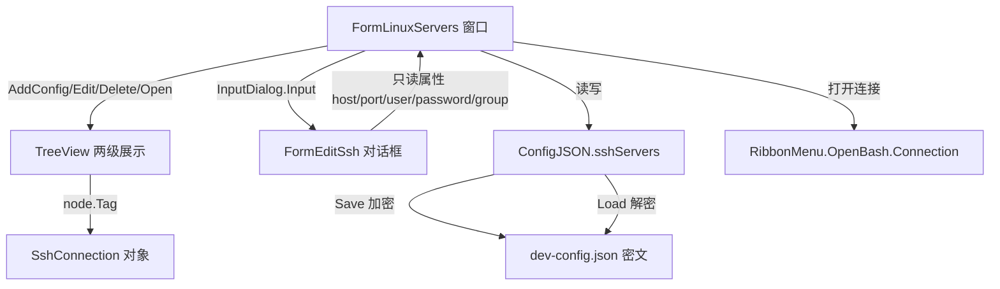

## 用户需求

在 Vallina 项目的 Linux 服务器会话管理窗口中，实现对 SSH 连接参数（主机地址、端口、账号、密码、分组标签）的完整管理功能，并在配置文件中安全持久化（密码使用 Windows DPAPI 加密）。

## 产品概述

提供一个 Linux 服务器 SSH 会话管理器：用户可新增、编辑、删除 SSH 连接配置，按分组标签以两级 TreeView 展示，并可一键打开 SSH 终端连接。所有配置安全保存在本地 JSON 文件中。

## 核心功能

- 通过 FormEditSsh 对话框填写并校验 SSH 连接参数（host、port、user、password、group）
- 以两级 TreeView 展示：根节点为分组标签，子节点为具体连接；空分组不显示，空 group 归入默认分组
- AddConfig 按钮：新增连接，写入配置并刷新 TreeView
- 右键菜单（打开连接 / 编辑 / 删除）：打开 SSH 终端、预填编辑已有配置、删除配置
- 双击节点等同于打开连接
- Application\Settings 新增 SSH 配置存储读取模块，密码经 Windows DPAPI 加密后落盘，加载时解密还原到内存

## 技术栈

- 语言/框架：Visual Basic .NET（WinForms），沿用现有 Vallina 项目架构
- 配置持久化：JSON 文件（`dev-config.json`，位于 `App.ProductProgramData`）
- 密码加密：`System.Security.Cryptography.ProtectedData`（DPAPI，CurrentUser scope，密钥不出本机）
- 对话框机制：复用现有 `Galaxy.Workbench.CommonDialogs.InputDialog.Input(Of T)` 模式（遮罩 + DialogResult.OK 回调）

## 实现方案

### 总体策略

在不引入新架构模式的前提下，复用现有 Settings 配置体系（`ConfigJSON` + 简单 POCO 类）与 InputDialog 对话框机制，新增 SSH 专用配置类与 UI 交互逻辑。核心数据流：用户操作 → 更新 `SshServerConfig` 内存集合 → `ConfigJSON.Save()` 落盘（密码加密）→ TreeView 重绘（node.Tag 绑定 `SshConnection`）。

### 关键技术决策

1. **密码安全**：配置类内部仅持久化 `passwordProtected`（DPAPI 加密后的 base64 字符串）。对外暴露的 `Password` 属性在 get 时解密、set 时加密，确保 JSON 序列化落盘的是密文而非明文。这是对现有 `devTools` 这类纯明文 POCO 的必要扩展，因为明文存密码违反安全要求。
2. **两级 TreeView**：根节点 Text=group 名称，Tag=Nothing（标记为非连接节点）；子节点 Text=连接显示名（如 `user@host:port`），Tag=`SshConnection` 实例。右键菜单与双击操作前均需校验 `node.Tag IsNot Nothing` 且 `node.Parent IsNot Nothing`，防止误操作分组节点。
3. **编辑预填**：`FormEditSsh` 新增 `SetConfig(conn As SshConnection)` 方法，在 InputDialog 回调前将现有连接参数填充到输入框；保存时写回同一对象引用（或替换集合中的对应项）。
4. **默认分组**：新增连接时若 group 为空，统一归为 `"Default"`，保证两级结构始终成立。
5. **删除菜单**：现有 Designer 中右键菜单仅有 Open/Edit，需在 `FormLinuxServers.Designer.vb` 补充 `DeleteToolStripMenuItem` 及对应事件处理（`Handles DeleteToolStripMenuItem.Click`）。

### 性能与可靠性

- 配置规模小（十~百级连接），TreeView 全量重建开销可忽略；采用先清空再按 group 聚合重建的简单策略，避免增量更新的边界错误。
- DPAPI 解密失败（如配置被其他用户复制）应兜底为空字符串并保留其他字段，避免崩溃。
- `ConfigJSON.Load()` 需对 `sshServers` 做 Nothing 兜底初始化，避免首次启动空配置报错。

## 实现注意事项

- 仅在已有 `ConfigJSON` 上新增 `sshServers` 属性，不要改动 `appearance/llm/devTools` 既有逻辑，保持向后兼容。
- `FormEditSsh` 的 port 解析失败应回退默认值 22；password 使用 `MaskedTextBox` 避免明文暴露。
- TreeView 重建后需保留/恢复选中状态体验（可选，非必须）。
- 复用现有 `Imports Microsoft.VisualBasic.Serialization.JSON` 的 `LoadJsonFile/SaveTo` 扩展方法，不引入新序列化库。

## 架构设计



## 目录结构

```
g:\DevAgent\src\Vallina\
├── Application\
│   └── Settings\
│       ├── ssh.vb              # [NEW] SSH 配置类。定义 SshConnection（host, port, user, Password 加解密属性, group）与 SshServerConfig（List(Of SshConnection) + 增删查辅助）。Password 内部存 passwordProtected(base64)，get/set 经 DPAPI 加解密。
│       └── ConfigJSON.vb       # [MODIFY] 新增 Public Property sshServers As SshServerConfig；Load() 中补充 sshServers 的 Nothing 兜底初始化。
├── Dialogs\
│   ├── FormEditSsh.vb          # [MODIFY] 实现 host/port/user/password/group 只读属性 getter；新增 SetConfig(conn) 预填方法；port 解析失败回退 22。
│   └── FormEditSsh.Designer.vb # [MODIFY] 补齐控件：hostTextBox, portTextBox, userTextBox, passwordMaskedTextBox, groupTextBox 及对应 Label（沿用 InputDialog 已有确定/取消按钮机制）。
└── ToolWindow\
    ├── FormLinuxServers.vb     # [MODIFY] 实现 Load 构建 TreeView、AddConfig 新增、EditToolStripMenuItem 编辑、新增 DeleteToolStripMenuItem 删除、OpenConnection 打开连接；全部经 ConfigJSON 持久化。
    └── FormLinuxServers.Designer.vb # [MODIFY] ContextMenuStrip1 新增 DeleteToolStripMenuItem 菜单项及声明。
```

## 关键代码结构（可选）

```
Namespace Settings
    Public Class SshConnection
        Public Property host As String
        Public Property port As Integer = 22
        Public Property user As String
        Public Property group As String = "Default"
        ' 仅持久化密文
        Public Property passwordProtected As String
        ' 对外明文，get 解密 / set 加密
        Public Property Password As String
    End Class

    Public Class SshServerConfig
        Public Property connections As New List(Of SshConnection)
        Public Function Find(predicate As Func(Of SshConnection, Boolean)) As SshConnection
        Public Sub Remove(conn As SshConnection)
    End Class
End Namespace
```